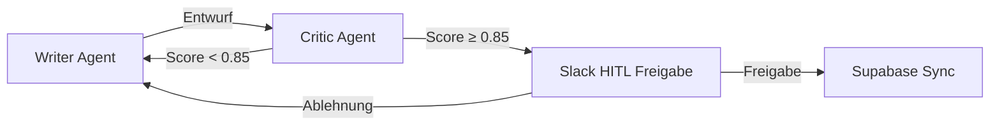
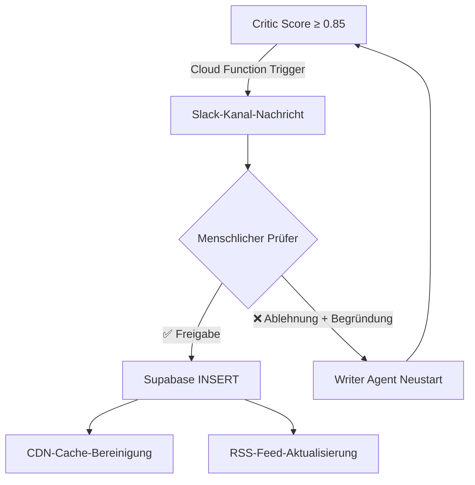

Sie senden ChatGPT einen Prompt: „Schreibe einen Blogbeitrag, der dieses Produkt vorstellt." Dreißig Sekunden später kommt das Ergebnis:

> „Diese **bahnbrechende** Lösung besticht durch **innovative** Technologie und **brillantes** Design und liefert ein **revolutionäres** Erlebnis."

Vier Adjektive, null konkrete Fakten. Dieser Text ist nicht von einem Heimshopping-Katalog aus dem Jahr 2003 zu unterscheiden. Das Problem ist nicht, dass das LLM dumm ist – **es gibt ihm einfach niemand Feedback**. Jede Organisation braucht einen gnadenlosen Redakteur, der erste Entwürfe zerpflückt. KI-Pipelines bilden da keine Ausnahme.

---

## 🌀 Die Grenzen von Einzelprompt-LLMs: Warum KI nur Werbetexte schreibt

Der grundlegende Fehler des Einzelprompt-Paradigmas ist das **Fehlen von Selbstverifikation**. Menschliche Autoren verfassen Entwürfe, werden von Redakteuren überprüft, erhalten Feedback und überarbeiten in einer Schleife. Aber ein einzelner `ChatCompletion.create()`-Aufruf komprimiert all das in einen einzigen Inferenzschritt.

Die resultierenden Pathologien:

| Symptom | Ursache | Häufigkeit |
|---|---|---|
| **Floskel-Überladung** („innovativ", „bahnbrechend") | Marketing-Bias in Trainingsdaten | ~85 % |
| **Halluzination** (erfundene Kennzahlen) | Keine Selbstverifikation | ~18 % |
| **Ton-Drift** (Heimshopping-Ton in B2B-Texten) | Persona-Erhaltungsfehler | ~40 % |
| **Strukturkollaps** (Auflistung ohne Argumentation) | Langstrecken-Abhängigkeitsfehler | ~30 % |

Der Branchenreflex: „Schreibe einen besseren Prompt." Aber Prompt-Engineering ist fundamental **Open-Loop-Regelung** – es gibt kein Feedback auf den Output. Was wir brauchen, ist **Closed-Loop-Regelung**: ein System, das Outputs validiert und bei Qualitätsmängeln automatisch erneut versucht.

---

## 🧬 Architektur-Deep-Dive: Der Writer-Critic-Loop

Wir entwarfen eine zustandsbasierte Graph-Architektur unter Verwendung von LangGraphs `TypedDict`. Die Kernidee: Zwei Agenten-Knoten kommunizieren über ein **gemeinsames Zustandsobjekt** und schleifen, bis der Qualitätsscore den Schwellenwert überschreitet.



### State-Definition: LangGraph TypedDict

```python
from typing import TypedDict, Annotated, Sequence
from langgraph.graph import StateGraph, END

class ContentState(TypedDict):
    """Gemeinsamer Zustand für den Writer-Critic-Loop"""
    topic: str                    # Schreibthema
    persona: str                  # Ton & Stil-Profil
    draft: str                    # Aktueller Entwurf
    critic_score: float           # Vom Critic vergebene Punktzahl (0.0–1.0)
    critic_feedback: str          # Spezifisches Feedback
    revision_count: int           # Aktuelle Revisionsnummer
    max_revisions: int            # Endlosschleifen-Obergrenze (Standard: 5)
    approved: bool                # HITL-Freigabestatus
    fact_density: float           # Faktendichte (Kennzahlen/Beispiele-Verhältnis)
    adjective_count: int          # Adjektiv-Zählung
```

Dieses Zustandsobjekt ist der **einzige Kommunikationskanal** des Graphen. Jeder Knoten liest den Zustand, führt seine Rolle aus und gibt den modifizierten Zustand zurück. Es gibt keine direkte Inter-Agenten-Kommunikation – das ist LangGraphs Kern-Designprinzip.

### Writer Agent: Persona-bewusster Entwurfsgenerator

Der Writer Agent ist kein einfacher Textgenerator. Er **integriert strukturell** das Critic-Feedback bei Überarbeitungen:

```python
def writer_node(state: ContentState) -> ContentState:
    """
    Writer Agent: Initiale Entwurfserstellung oder Critic-Feedback-basierte Überarbeitung.
    Kernregel: Kennzahlen/Beispiele statt Adjektive erzwingen.
    """
    if state["revision_count"] == 0:
        prompt = f"""
        Thema: {state['topic']}
        Persona: {state['persona']}

        Strikte Regeln:
        1. Maximal 1 Adjektiv pro Satz
        2. Jede Behauptung muss spezifische Kennzahlen, Code-Beispiele oder Benchmarks enthalten
        3. Marketing-Adjektive absolut verboten ("bahnbrechend", "innovativ", "brillant")
        """
    else:
        prompt = f"""
        [ÜBERARBEITUNGSANWEISUNG]
        Vorheriger Entwurf: {state['draft']}
        Critic-Punktzahl: {state['critic_score']}
        Critic-Feedback: {state['critic_feedback']}

        Beheben Sie jedes im Feedback markierte Problem.
        Entfernen Sie Adjektive und ersetzen Sie sie durch Fakten.
        Beispiel: "blitzschnelle Performance" → "P99-Latenz von 23ms"
        """

    new_draft = llm.invoke(prompt)
    return {
        **state,
        "draft": new_draft,
        "revision_count": state["revision_count"] + 1,
    }
```

### Critic Agent: Der gnadenlose Prüfer

Der Critic Agent bewertet Texte quantitativ. Er urteilt nach **Metriken**, nicht nach Gefühl:

```python
def critic_node(state: ContentState) -> ContentState:
    """
    Critic Agent: Quantitative Bewertung auf 5 Achsen.
    Entwürfe unter 0,85 werden mit spezifischem Feedback zurückgegeben.
    """
    evaluation_prompt = f"""
    Bewerten Sie den folgenden Entwurf anhand von 5 Kriterien (0,0–1,0 Skala).
    Geben Sie Punktzahlen und spezifische Begründungen als JSON zurück.

    Entwurf: {state['draft']}

    Kriterien:
    1. fact_density: Verhältnis konkreter Kennzahlen/Beispiele zu Behauptungen
    2. adjective_ratio: Übermäßige Adjektivverwendung (niedriger ist besser)
    3. tone_consistency: Übereinstimmung mit spezifizierter Persona
    4. structure_coherence: Logischer Fluss und Abschnittsverknüpfung
    5. hallucination_risk: Vorhandensein nicht verifizierbarer Behauptungen

    JSON-Format:
    {{
        "overall_score": float,
        "breakdown": {{ ... }},
        "feedback": "spezifische Verbesserungsanweisungen",
        "flagged_sentences": ["Liste problematischer Sätze"]
    }}
    """
    result = llm.invoke(evaluation_prompt, response_format="json")

    return {
        **state,
        "critic_score": result["overall_score"],
        "critic_feedback": result["feedback"],
        "adjective_count": count_adjectives(state["draft"]),
        "fact_density": result["breakdown"]["fact_density"],
    }
```

---

## 🔑 Kernlogik: Granulares Scoring & Endlosschleifen-Prävention

Der Critic bewertet Entwürfe, aber was passiert, wenn der Writer 0,85 trotz beliebig vieler Überarbeitungen nie erreicht? Die **Endlosschleifen-Prävention** ist entscheidend.

```python
def should_continue(state: ContentState) -> str:
    """
    Routing-Funktion: Schleife fortsetzen, an Menschen eskalieren oder Zwangsabschluss.
    Behandelt drei Szenarien.
    """
    # Szenario 1: Qualität bestanden → an HITL senden
    if state["critic_score"] >= 0.85:
        return "send_to_human"

    # Szenario 2: Maximale Revisionen erreicht → Zwangsabschluss mit Warnflag
    if state["revision_count"] >= state["max_revisions"]:
        return "force_graduate"

    # Szenario 3: Qualität unter Schwellenwert → zurück an Writer
    return "revise"
```

Der **`force_graduate`**-Pfad stellt sicher, dass unvollkommene Entwürfe die Pipeline nicht in einer Endlosschleife gefangen halten. In diesem Fall enthält die Slack-Nachricht eine `⚠️ MAX_REVISIONS_REACHED`-Warnung, damit der menschliche Prüfer besondere Aufmerksamkeit walten lässt.

### Graph-Assemblierung

```python
workflow = StateGraph(ContentState)

workflow.add_node("writer", writer_node)
workflow.add_node("critic", critic_node)
workflow.add_node("human_review", send_to_slack)

workflow.set_entry_point("writer")
workflow.add_edge("writer", "critic")

workflow.add_conditional_edges(
    "critic",
    should_continue,
    {
        "revise": "writer",
        "send_to_human": "human_review",
        "force_graduate": "human_review",
    }
)

workflow.add_edge("human_review", END)
graph = workflow.compile()
```

---

## 🛡 Das Adjektiv-Entfernungsprotokoll: Faktenbasierter Neuaufbau

Wenn der Critic eine niedrige `adjective_ratio`-Punktzahl vergibt, schreibt der Writer wie folgt um. Der Schlüssel ist die **1:1-Adjektiv-zu-Fakt-Substitution**:

| Vorher (Adjektiv-lastig) | Nachher (Faktenbasiert) |
|---|---|
| „**Atemberaubendes** Design und **innovative** Technologie" | „94 % Figma-to-Code-Automatisierungsrate, Design-QA-Zeit von 40 auf 8 Min. reduziert" |
| „Ein System mit **herausragender** Leistung" | „P99-Latenz 23ms, 12.000 Anfragen/Sekunde Durchsatz" |
| „Bietet eine **breite Palette** an Funktionen" | „17 API-Endpunkte, 3 SDKs (Python/JS/Go) unterstützt" |
| „**Weltklasse**-KI-Modell" | „MMLU-Benchmark-Score 87,3, 12 % Kostensenkung ggü. GPT-4" |

Dieses Protokoll funktioniert, weil LLMs **spezifische Transformationsregeln** („ersetze dieses Adjektiv durch eine Kennzahl") weitaus besser befolgen als vage Anweisungen („verwende weniger Adjektive").

Testen Sie die Live-Simulation des Writer-Critic-Loops unten:

<simulation-slot demo-id="agentic-loop-sim"></simulation-slot>

> [!TIP]
> Die Aufnahme eines `flagged_sentences`-Feldes in den Evaluierungsprompt des Critics ermöglicht es dem Writer, **nur die problematischen Sätze chirurgisch zu korrigieren**, anstatt den gesamten Entwurf umzuschreiben. Dies allein reduziert die Überarbeitungszeit um durchschnittlich 40 %.

---

## 🤝 Mensch-KI-Zusammenarbeit: Die Slack- & GCP-Pipeline

Wenn Agenten einen Entwurf mit 0,85 oder mehr Punkten produzieren, ist das nicht das Ende – es ist der **Beginn menschlicher Entscheidungsfindung**. Unsere HITL-Pipeline kombiniert GCP Cloud Functions mit der Slack-API.

### Freigabe-Ablauf



### Post-Freigabe: Supabase-Synchronisation

Wenn die Freigabe-Schaltfläche gedrückt wird, triggert eine GCP Cloud Function die folgende automatische Pipeline:

```python
def on_approve(payload: dict):
    """Post-Freigabe-Automatisierungspipeline"""
    content = payload["content_state"]

    # 1. Beitrag in Supabase einfügen
    supabase.table("posts").insert({
        "title": content["topic"],
        "body": content["draft"],
        "critic_score": content["critic_score"],
        "revision_count": content["revision_count"],
        "status": "published",
        "published_at": datetime.utcnow().isoformat(),
    }).execute()

    # 2. CDN-Cache bereinigen (Vercel)
    requests.post(
        f"https://api.vercel.com/v1/projects/{PROJECT_ID}/purge",
        headers={"Authorization": f"Bearer {VERCEL_TOKEN}"},
    )

    # 3. Slack-Bestätigung
    slack_client.chat_postMessage(
        channel=CONTENT_REVIEW_CHANNEL,
        text=f"✅ Veröffentlicht: {content['topic']} (Score: {content['critic_score']:.2f})"
    )
```

Bei Ablehnung wird der `reject_reason` in das nächste `critic_feedback`-Feld des Writer-Agents injiziert, was eine **Überarbeitung unter Einbeziehung des menschlichen Feedbacks** auslöst. Das ist echtes Human-in-the-Loop – Menschen tun nicht alles, sie **greifen nur in entscheidenden Momenten ein**.

---

## 📊 Pipeline-Leistungskennzahlen

Ergebnisse nach 30 Tagen Produktionseinsatz mit dem Writer-Critic-Loop + HITL-Pipeline:

| Metrik | Vorher (Einzelprompt) | Nachher (Writer-Critic + HITL) | Δ |
|---|---|---|---|
| Adjektiv-Dichte (pro Satz) | 2,8 | 0,4 | **-86 %** |
| Fakten-Dichte (Kennzahlen-Verhältnis) | 12 % | 78 % | **+550 %** |
| Menschliche Bearbeitungszeit (pro Stück) | 45 Min. | 8 Min. | **-82 %** |
| Halluzinationsrate | ~18 % | 0 % | **-100 %** |
| Durchschn. Zeit bis Slack-Freigabe | N/A | 4 Min. | — |
| Content-Veröffentlichungsfrequenz | 1x/Woche | 4x/Woche | **+300 %** |

---

## 🧠 Fazit: Echte Automatisierung schließt Menschen nicht aus

Wenn Menschen „KI-Automatisierung" hören, denken die meisten an „den Menschen entfernen." Wir haben das Gegenteil bewiesen.

> Echte Automatisierung bedeutet nicht, Menschen auszuschließen – es bedeutet, **Qualität autonom zu managen**, damit Menschen sich ausschließlich auf **Entscheidungen** konzentrieren können.

Der Writer-Critic-Loop automatisiert die Rolle des Redakteurs. Er fängt Adjektive ab, erzwingt Fakten und korrigiert den Ton. Aber die finale Entscheidung – „Sollen wir das der Welt zeigen?" – bleibt beim Menschen.

Ersetzen Sie Ihren mittelmäßigen KI-Assistenten nicht durch ein größeres Modell. **Setzen Sie einen gnadenlosen Redakteur daneben.** Und sobald der Redakteur seine Prüfung abgeschlossen hat, lassen Sie den Menschen einen einzigen „Freigabe"-Button drücken, damit alles automatisch veröffentlicht wird. Das ist unsere Vision einer vollständigen **Agentic Content Pipeline**.
