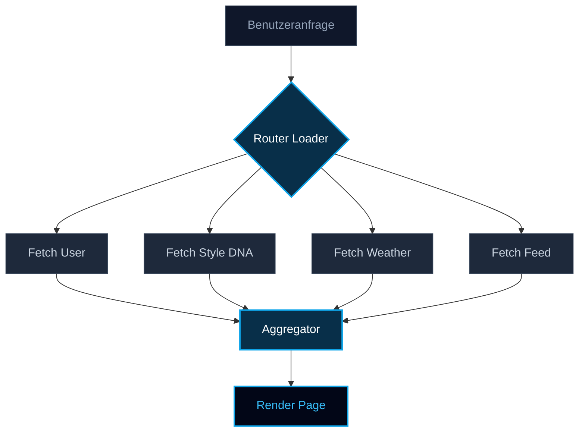

## 1. Das Problem: Die unsichtbare Kette der Latenz

In modernen KI-gesteuerten Anwendungen wie **Pickle AI** wird die Benutzererfahrung ständig von Latenz bedroht. Während generative Modelle Bilder verarbeiten (was bis zu 10 Sekunden dauern kann), verschlimmert das Frontend die Wartezeit oft, indem es Metadaten sequenziell abruft.

Dies ist das **Sequenzielle Wasserfall-Anti-Pattern (Sequential Waterfall Anti-Pattern)**.

Stellen Sie sich vor, ein Benutzer gelangt auf ein personalisiertes Dashboard. Das System muss Folgendes tun:
1. Den Benutzer identifizieren.
2. Seine Style-DNA abrufen.
3. Das lokale Wetter abrufen.
4. Den Trending-Feed abrufen.

Wenn jeder Abruf 100ms dauert, wartet der Benutzer 400ms, bevor der Lade-Spinner überhaupt verschwindet. Dies ist **Linear Skalierende Latenz (Linear Scaling Latency)**: $$T = t_1 + t_2 + t_3 + ...$$

---

## 2. Das mentale Modell: Der Einzelkoch vs. Die Küchenbrigade

Denken Sie an eine traditionelle Web-App wie an einen **Einzelkoch (Single Chef)**.
Der Koch kocht das Wasser, schneidet *dann* die Zwiebeln, brät *dann* das Steak. Wenn jede Aufgabe 5 Minuten dauert, wird das Abendessen in 15 Minuten serviert.

Die **Ghost Speed Architektur** entspricht hingegen einer **Professionellen Küchenbrigade**.
Ein Koch kocht das Wasser, ein anderer schneidet die Zwiebeln und ein dritter brät das Steak – alles zur gleichen Zeit. Das Abendessen wird in 5 Minuten serviert (der Zeit der längsten Einzelaufgabe).

---

## 3. Die Erkenntnis: Parallele Ausführung über React Router v7

React Router v7 Loaders bieten eine „Pre-Render Execution Sandbox“. Anstatt Komponenten das Abrufen von Daten überlassen zu lassen (was Wasserfälle verursacht), verlagern wir das gesamte I/O auf das **Routing Level**.

Mit `Promise.all` lasten wir den Datenbank-Connection-Pool sofort maximal aus.



---

## 4. Die Ausführung: Sättigung des Connection Pools

Hier ist, wie wir die „Brigade“ im Code implementieren. Wir rufen nicht nur ab; wir orchestrieren Datensilos simultan.

```typescript
// /app/routes/lab.ghost-speed.tsx
export async function loader({ request }) {
  const startTime = performance.now();

  // Entkopplung von 13 gleichzeitigen Promises
  const [profile, dna, weather, feed, social, analytics] = await Promise.all([
    fetchUserProfile(request),
    getStyleDNA(request),
    getLocalWeather(request),
    getTrendingFeed(request),
    // ... 9 weitere gleichzeitige Aufrufe
  ]);

  const endTime = performance.now();
  console.log(`Ghost Speed execution: ${endTime - startTime}ms`);

  return data({ profile, dna, weather, feed });
}
```

Durch die Umstellung der Komplexität von $$O(N)$$ auf $$O(\max(N))$$ veränderte sich unser Latenzprofil von einer Treppe zu einer geraden Linie. Ob wir 3 oder 13 Elemente abrufen, die Dauer bleibt die Zeit der einzelnen, langsamsten Abfrage.

---

## 5. Interaktive Simulation: Erleben Sie den Unterschied

Verwenden Sie den folgenden Simulator, um zwischen dem traditionellen Waterfall-Modus und unserer Ghost Speed Pipeline zu wechseln. Beobachten Sie, wie sich die Gesamt-Latenz verhält, wenn das Netzwerk effizient parallelisiert wird.

<simulation-slot demo-id="ghost-speed" title="Parallelisierungs-Simulator"></simulation-slot>

---

## 6. Der B2B-ROI: Warum dies für Ihr Unternehmen wichtig ist

In der Enterprise-Software-Welt bedeutet 100ms zusätzliche Latenz oft einen Konversionsrückgang von 1%. Für eine Plattform mit dem Ziel von 100M Daily Active Users entspricht das Millionen von Dollar an entgangenen Einnahmen.

Bei SmartWorkLab bauen wir nicht nur „Features“. Wir bauen echte Ingenieur-Infrastruktur auf.

- **Reduzierte Absprungraten**: Benutzer sehen den Inhalt ohne wahrnehmbare Verzögerung.
- **Geringere Serverkosten**: Effizientes Connection Pooling reduziert Leerlaufzeiten der Architektur drastisch.
- **Zukunftssichere Skalierbarkeit**: Ihre Anwendung bleibt blitzschnell, selbst wenn ihre Komplexität im Hintergrund stetig wächst.

Sind Sie bereit, Ihre Infrastruktur von einem Einzelkoch zu einer globalen Brigade aufzurüsten?

<br/>
