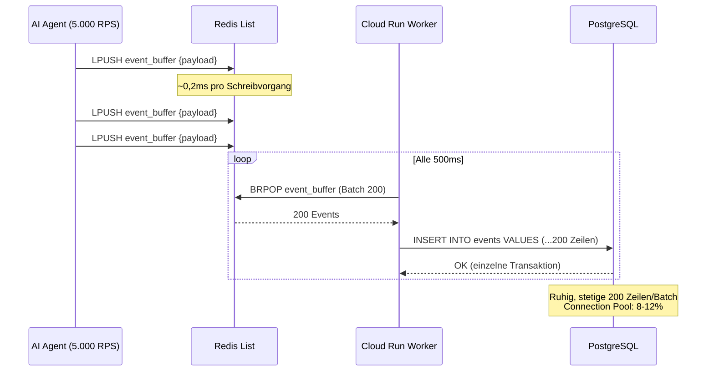

Connection-Pool-Erschöpfung während eines AI-Traffic-Spikes ist der stille Killer von Produktionsdatenbanken. Es gibt keine höfliche Warnung. Sie bekommen eine kaskadierende Wand von `CONNECTION_REFUSED`-Fehlern um 3 Uhr morgens, einen brennenden Slack-Kanal und eine PostgreSQL-Instanz, die in Row-Level-Contention so schwer gefangen ist, dass selbst Ihre Health-Checks ausfallen.

Wir haben das auf die harte Tour gelernt.

> **Die brutale Physik der Row-Level Locks:**
> Wenn 2.000 gleichzeitige AI-Agent-Anfragen jeweils versuchen, eine Zeile in die gleiche PostgreSQL-Tabelle zu `INSERT`en, verlangsamt sich die Datenbank nicht nur — sie gerät in einen **Deadlock**. Jede Transaktion greift einen Row-Level Lock, wartet auf den Connection-Pool und hält Ressourcen als Geisel. Bei 5.000 RPS ist Ihr 100-Verbindungs-Pool kein Pool mehr. Es ist ein Parkplatz.

---

## 🔥 Das Problem: PostgreSQL wurde nicht für Write Storms gebaut

Was passiert, wenn Ihr AI-Agent viral geht und jeder Inferenz-Callback direkt nach Postgres schreibt:

| Metrik | Direkte Schreibvorgänge | Redis Write-Buffer |
|---|---|---|
| **Max. nachhaltige RPS** | ~500 | 5.000+ |
| **p99 Latenz** | 800ms → Timeout | 15ms (flach) |
| **Connection-Pool-Nutzung** | 100% (erschöpft) | 8–12% |
| **Fehlerrate bei 2.000 RPS** | 35–78% | 0% |
| **Row-Level-Lock-Contention** | Katastrophal | Keine |

PostgreSQLs MVCC-Engine ist für **Konsistenz** optimiert, nicht für **Durchsatz**. Bei tausenden gleichzeitigen `INSERT`-Anweisungen erwirbt jede Transaktion über <kbd>SELECT ... FOR UPDATE</kbd> oder implizite Insert-Locks einen Row-Level Lock. Der Connection-Pool wird zum Flaschenhals.

> Stellen Sie sich das so vor: PostgreSQL ist **Der Tresor** — akribisch sicher, transaktional perfekt, aber mit einem einzigen Eingang und einem Wächter, der jeden Ausweis prüft. Redis ist **Die schnelle Kasse** — sie nimmt Ihre Bestellung sofort an, schreibt sie auf ein Ticket und liefert die Tickets alle paar Sekunden gebündelt an den Tresor. Wenn ein Flashmob kommt, hält die Kasse die Schlange in Bewegung. Der Tresor bemerkt den Ansturm nicht einmal.

---

## 🧪 Probieren Sie es: Traffic-Surge-Simulator

<simulation-slot demo-id="redis-buffer-sim"></simulation-slot>

> [!TIP]
> Starten Sie mit "Direct to Postgres" bei 1.000+ RPS, um den Connection-Pool explodieren zu sehen. Wechseln Sie dann zu "Redis Write-Buffer" und drehen Sie auf 5.000 RPS — beachten Sie, wie die Latenz flach bei ~15ms bleibt und die Fehlerrate bei 0% verharrt.

---

## 🏗 Architektur: Die Redis Stream-to-Bulk Pipeline

Das Kernmuster ist eine dreistufige entkoppelte Pipeline:

1. **Hot Path** (Agent → Redis): Jeder Schreibvorgang ist ein einzelner <kbd>LPUSH</kbd> in eine Redis List. Sub-Millisekunde. Keine Locks.
2. **Worker Path** (Redis → Worker): Ein GCP Cloud Run Worker ruft <kbd>BRPOP</kbd> in einer Schleife auf und bündelt Nachrichten.
3. **Cold Path** (Worker → PostgreSQL): Der Worker führt ein einzelnes `INSERT ... VALUES` mit 200 Zeilen pro Batch aus.



Die kritische Erkenntnis: **PostgreSQL sieht den Spike nie.** Es empfängt einen stetigen, vorhersagbaren Strom von Bulk-Inserts, unabhängig davon, ob der Upstream-Traffic 100 RPS oder 50.000 RPS beträgt.

---

## 🛠 Clean Code: Das Redis Stream Append Pattern

### Producer: Sub-Millisekunden-Schreibpfad

```python
import redis
import json
import time

r = redis.Redis(host="redis-cluster.internal", port=6379, db=0)

def buffer_event(event: dict) -> None:
    """
    Event an Redis List anhängen. ~0,2ms pro Aufruf.
    Null Connection-Pool-Druck auf PostgreSQL.
    """
    payload = json.dumps({
        **event,
        "buffered_at": time.time(),
    })
    r.lpush("event_buffer", payload)
```

Jeder AI-Agent-Callback ruft `buffer_event()` auf, anstatt Postgres direkt zu treffen. Die <kbd>LPUSH</kbd>-Operation ist O(1) und wird in ~0,2ms abgeschlossen.

### Consumer: Bulk-Flush-Worker

```python
import psycopg2
from psycopg2.extras import execute_values

BATCH_SIZE = 200

def flush_worker():
    """
    Langlebiger Worker, der BRPOP-Batches aus Redis
    holt und per Bulk-Insert in PostgreSQL schreibt.
    """
    pg = psycopg2.connect(dsn="postgresql://...")
    batch = []

    while True:
        result = r.brpop("event_buffer", timeout=1)
        if result:
            _, raw = result
            batch.append(json.loads(raw))

        if len(batch) >= BATCH_SIZE or (batch and not result):
            with pg.cursor() as cur:
                execute_values(
                    cur,
                    """
                    INSERT INTO events (user_id, event_type, payload, buffered_at)
                    VALUES %s
                    """,
                    [
                        (e["user_id"], e["event_type"],
                         json.dumps(e["payload"]), e["buffered_at"])
                        for e in batch
                    ],
                )
            pg.commit()
            batch.clear()
```

---

## 📊 Vergleich: Vorher vs. Nachher

| Dimension | Vorher: Direkte DB-Writes | Nachher: Redis Write-Buffer |
|---|---|---|
| **Schreib-Latenz (p99)** | 800ms → 5.000ms (Timeout) | 0,2ms (Redis) + 15ms (Batch-Flush) |
| **Postgres-Verbindungen** | 100/100 (gesättigt) | 8–12/100 (ruhig) |
| **Row-Level-Lock-Contention** | Kaskadierende Deadlocks | Null — einzelne Bulk-Transaktion |
| **Fehlerrate bei 5.000 RPS** | 78%+ `CONNECTION_REFUSED` | 0% |
| **Datenhaltbarkeit** | Verlorene Writes (abgelehnt) | Redis AOF + Batch-Bestätigung |
| **Horizontale Skalierung** | Postgres-Replicas hinzufügen (&#36;&#36;&#36;) | Cloud Run Worker hinzufügen (&#36;) |

---

## 🔒 Haltbarkeitsgarantien

Ein häufiger Einwand: *"Aber Redis ist In-Memory. Was passiert bei einem Crash?"*

1. **Redis AOF Persistence**: Mit `appendonly yes` persistiert Redis jeden Schreibvorgang innerhalb von 1 Sekunde auf die Festplatte.
2. **Batch-Bestätigung**: Der Worker entfernt Events erst nach erfolgreichem PostgreSQL `COMMIT` aus Redis.
3. **Dead Letter Queue**: Events, die nach 3 Versuchen fehlschlagen, werden in eine `event_buffer_dlq` List verschoben.

---

## 🧠 Fazit: Den Tresor schützen, die Kasse skalieren

PostgreSQL ist außergewöhnlich bei ACID-Transaktionen und komplexen Abfragen. Aber es wurde nie als High-Throughput-Schreib-Endpunkt für tausende gleichzeitiger AI-Agents konzipiert.

Redis Write-Buffer invertiert den Druck:

1. **Absorbieren** — Traffic-Spikes mit O(1) <kbd>LPUSH</kbd>-Schreibvorgängen.
2. **Bündeln** — Events in Chunks, die PostgreSQL komfortabel verarbeiten kann.
3. **Flushen** — In einzelnen Bulk-Transaktionen — ein Lock, 200 Zeilen, fertig.
4. **Skalieren** — Durch zustandslose Worker, nicht teure Datenbank-Replicas.

Das Ergebnis? **Zero Downtime beim Launch.** Null Connection-Pool-Erschöpfung. Null verlorene Writes.

> Die beste Datenbankarchitektur ist eine, in der Ihre teuerste Komponente nie erfährt, dass es einen Traffic-Spike gab.

<agency-cta />
