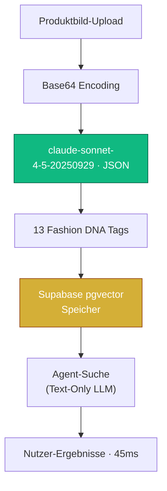

Sie haben ein Fashion-Produktbild. Ein Nutzer fragt: *"Finde mir etwas Ähnliches, aber formeller."* Der naive Ansatz? Senden Sie das Bild bei jeder einzelnen Suche an ein Vision-Language Model.

> **Die brutale Ökonomie der Echtzeit-VLM-Inferenz:**
> Herzlichen Glückwunsch — Sie haben gerade \$0,03 und 6 Sekunden Latenz für eine Anfrage verbrannt. Skalieren Sie das auf 10.000 tägliche Suchen und Sie bluten \$300/Tag allein an Inferenzkosten.

---

## 🔥 Das Problem: Echtzeit-VLM-Inferenz skaliert nicht

Die unbequeme Wahrheit: **Vision-Language Models sind im großen Maßstab spektakulär teuer.**

| Metrik | Echtzeit VLM | Strukturierte Metadaten-Abfrage |
|---|---|---|
| **Kosten pro Suche** | \$0,030 | \$0,0001 |
| **Kosten pro 10k Suchen** | \$300,00 | \$1,00 |
| **Latenz** | 3,5–6,0s | 45ms |
| **Skalierungsverhalten** | O(n) pro Nutzer | O(1) pro Artikel |

> Echtzeit-VLM bei jeder Anfrage zu nutzen ist wie einen Elite-Kunstkritiker im Gang stehen zu lassen, der jedes Mal ein Hemd analysiert, wenn ein Kunde vorbeigeht. **Vision-at-the-Gate** lässt den Kritiker einmal im Lager ein detailliertes Spezifikationsblatt schreiben und überlässt der schnellen Datenbank die Kundenbetreuung.

---

## 🧪 Probieren Sie es: Vision-at-the-Gate Simulator

<simulation-slot demo-id="vlm-scanner-sim"></simulation-slot>

---

## 🏗 Architektur: Vision-at-the-Gate

Die Kernidee: **Trenne die Verstehensphase von der Reasoning-Phase.**

Das VLM ist der **Gatekeeper** — es läuft einmal beim Eingang. Danach arbeiten alle nachgelagerten Operationen mit strukturierten Metadaten zu Text-only LLM-Kosten.

---

## 🧬 Deep Tagging: Fashion-DNA-Zerlegung

Das `claude-sonnet-4-5-20250929` Modell extrahiert 13 strukturierte Attribute aus einem einzigen Bildscan:

| Säule | Attribute | Zweck |
|---|---|---|
| **Farbe & Material** | `primary_color`, `material`, `material_weight` | Physische Eigenschaftsfilterung |
| **Style Tags** | `silhouette`, `fit_type`, `pattern` | Ästhetische Klassifikation |
| **TPO / Formal Index** | `formal_index`, `occasion` | Kontextbewusste Suche |
| **Wärme / Saisonalität** | `warmth_index`, `season`, `layer_compatibility` | Klimabewusste Empfehlung |

---

## 🗄 Datenarchitektur: pgvector im Kern

| Vektor-Typ | Dim | Anwendungsfall | Status |
|---|---|---|---|
| `style_dna_vector` | 32 | Personalisierte Präferenzmodellierung | ✅ Aktiv |
| `description_embedding` | 1536 | OOTD Hybrid-Suche | ✅ Aktiv |
| `image_embedding` | 512 | Visuelle Ähnlichkeitssuche (CLIP) | 🗓 Roadmap |

---

## 📊 Die Ökonomie: 90% Kostensenkung

| Strategie | Kosten/10k Suchen | Jährlich |
|---|---|---|
| Echtzeit VLM | \$300/Tag | **\$108.000** |
| Vision-at-the-Gate | \$1/Tag | **\$360** |
| **Einsparung** | | **\$107.640 (99,7%)** |

> "In der KI-Architektur ist Vision zum Verstehen da, aber Metadaten sind zum Skalieren da."

---

## 🧠 Fazit: Vom ersten Tag an für Skalierung bauen

1. **Einmal scannen** am Lagereingang mit dem leistungsfähigsten VLM.
2. **DNA persistieren** als strukturierte Metadaten + Vektoren in pgvector.
3. **Günstig schlussfolgern** mit Text-only LLMs zur Suchzeit.
4. **Frei skalieren** — mehr Nutzer erhöhen nicht die VLM-Kosten.

> Echte Kostenoptimierung bedeutet nicht, billigere Modelle zu finden — sondern **teure Modelle seltener aufzurufen.**

<agency-cta />
