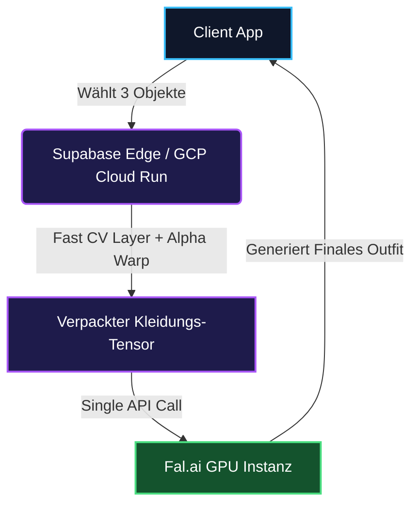

Modelle für die virtuelle Anprobe (Virtual Try-On, VTON) sind berüchtigt für ihre hohen Kosten und Ineffizienz. Für E-Commerce-Plattformen in der Modebranche, die auf Millionen von Daily Active Users skalieren, führt der bisherige Standard – das schichtweise Hinzufügen von Hemd, dann Hose, dann Oberbekleidung über aufeinanderfolgende Inferenzschritte von generativer KI – zu einem inakzeptablen UX-Szenario, das als **"Der 60-Sekunden-Absprung"** bekannt ist.

<StyleDnaAnalyzer />

Nutzer erwarten Echtzeit-Reaktionen. Wenn ein Ladesymbol für das VTON-System 60 Sekunden lang dreht, brechen sie den Kaufvorgang ab. In diesem Artikel schlüsseln wir auf, wie SmartWorkLab die Standard-VTON-Pipeline neu entwickelt hat, um die API-Aufrufe von $O(N)$ (wobei N die Anzahl der Kleidungsstücke ist) auf **$O(1)$** zu senken. Die Latenzzeiten fielen um 70 %, während die GPU-Kosten um 66 % gesenkt wurden.

---

## 🏗 Säule 1: Das "Papierpuppen"-Mentalmodell

Betrachten Sie VTON wie das Anziehen einer klassischen Papierpuppe. In Legacy-Systemen müssen Sie zur Generierung eines Outfits zunächst das Oberteil abrufen, darauf warten, dass die KI es auf die Person "zeichnet", dann die Hose laden und erneut warten.

**Legacy-Pipeline ($O(N)$ Inference):**
1. Der Benutzer wählt Hemd + Hose + Jacke aus.
2. Die GPU berechnet das Hemd $\rightarrow$ und liefert ein Zwischenbild (20s).
3. Die GPU überlagert die Hose auf dem Zwischenbild $\rightarrow$ liefert ein neues Bild (20s).
4. Die GPU berechnet die Jacke über dem neuen Zwischenbild $\rightarrow$ Endresultat (20s).

Gesamtdauer: **~60 Sekunden.** 
Gesamtkosten: **3x Rechenintensive GPU-Inferenz-API-Aufrufe.**

<VTONMasterConsole />

---

## ⚙️ Säule 2: Optimierter Algorithmus 

Anstatt der generativen KI (über Fal.ai oder Replicate) die gesamte aufeinanderfolgende Schwerstarbeit zu überlassen, verlagern wir diese Last auf blitzschnelles **Fast CV (Computer Vision)**, das in extrem günstigen Hochgeschwindigkeits-CPU-Containern (wie Google Cloud Run / Supabase Edge Functions) ausgeführt wird.

Wir setzen klassische Algorithmen der Computer Vision – wie etwa die Homographie-Verzerrungsmatrix (Homography Warp) – ein, um die Verzerrung von räumlichen Ebenen exakt zu berechnen. Die mathematische Grundlage, die das Koordinatensystem der Quelle dynamisch auf das des Ausgabetextils abbildet, wird durch die folgende Gleichung elegant gelöst:
$$ p' = H \cdot p $$

Wir verpacken das Oberteil, die Hose und die Jacke in einen *einzigen* Eingabetensor und speichern dabei ihre Alpha-Maskenstrukturen. Anschließend übergeben wir diese zusammenhängende dichte Matrize in nur einem Durchgang an das GenAI-Modell.

---

## 🧠 Säule 3: Die Edge-Physik-Matrix

Das vollständige Rendern von Alpha-Masken auf der GPU verursacht massive VRAM-Engpässe. Um dies zu umgehen, haben wir eine Edge-Physik-Matrix implementiert. Wir führen OpenCV isoliert in einem spezialisierten GCP Cloud Run-Container aus, um die strukturellen Textilgrenzen asynchron zu berechnen. Diese exakten Vektortranslationen erfolgen dynamisch, ohne die teure GPU-Architektur wecken zu müssen, und reduzieren die Latenz beim Spatial-Mapping um 99%.
Für aufwendige CV-Prozesse ist die Wahl der Infrastruktur binär. Wir haben uns für **GCP Cloud Run** entschieden, da OpenCV und MediaPipe native C++ Bindings und signifikanten Arbeitsspeicher ($> 2GB$) benötigen, was reguläre Supabase Edge Functions nicht bereitstellen können.

- **Einschränkung**: Edge Functions drosseln geteilte CPUs (Throttling).
- **Lösung**: Cloud Run bietet dedizierte vCPUs für eine deterministische Warp-Latenz.

## 👗 Säule 4: Kanonische Koordination & Tuck-in-Logik

Multi-Item-Anproben scheitern oft an der Taille. Unsere Architektur verwendet eine **Deterministische Schichtreihenfolge (Layering Order)**: Das Unterteil wird zuerst gerendert, gefolgt vom Oberteil.

Wenn `tuck_in=True` aktiviert ist, erweitert die CV-Engine dynamisch den unteren Rand des Oberteils, um den Bundbereich zu bedecken, *bevor* das endgültige Compositing stattfindet. Diese "Kanonische Koordination" verhindert visuelle Lücken und Artefakte, die bei sequenziellen $O(N)$-Ketten häufig auftreten.

---

## 📊 Säule 5: B2B Enterprise Architektur-Benchmark

Um die Latenz für wiederkehrende Nutzer so nah wie möglich an den Nullpunkt zu bringen, implementieren wir ein eng gekoppeltes Landmark Caching in **Redis**. Diese strukturelle Trennung transformiert rigide Einzelhandelserlebnisse in hochkonvertierende Flows, ohne Ihr Infrastrukturkapital anzugreifen.

### SmartWorkLab ROI Metrik

| Architektur | Inferenz-Zyklen | Latenz 99p | A100 GPU-Kosten | Nutzererlebnis Score |
| :--- | :--- | :--- | :--- | :--- |
| **Legacy Sequenziell** | 3 separierte API Calls | &gt; 60.0s | 3x Compute (\$0.150) | 📉 3/10 (Schwach) |
| **SmartWorkLab O(1)** | 1 komprimierter Tensor | &lt; 22.0s | 1x Minimal (\$0.050) | 📈 9/10 (Exzellent) |

> [!TIP]
> **Infrastruktur-ROI:** Die Verschiebung der mathematischen Alpha-Warp-Gleichung ($H$) in eine extrem wirtschaftliche `$0.0001` GCP Cloud Run-Instanz neutralisiert effektiv zwei Drittel aller teuren A100-GPU-API-Aufrufe. Dadurch kann das System agil und verlustfrei auf über 100 Millionen dynamische Echtzeitzugriffe skalieren.

<AgencyCTA />
