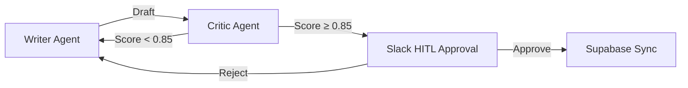
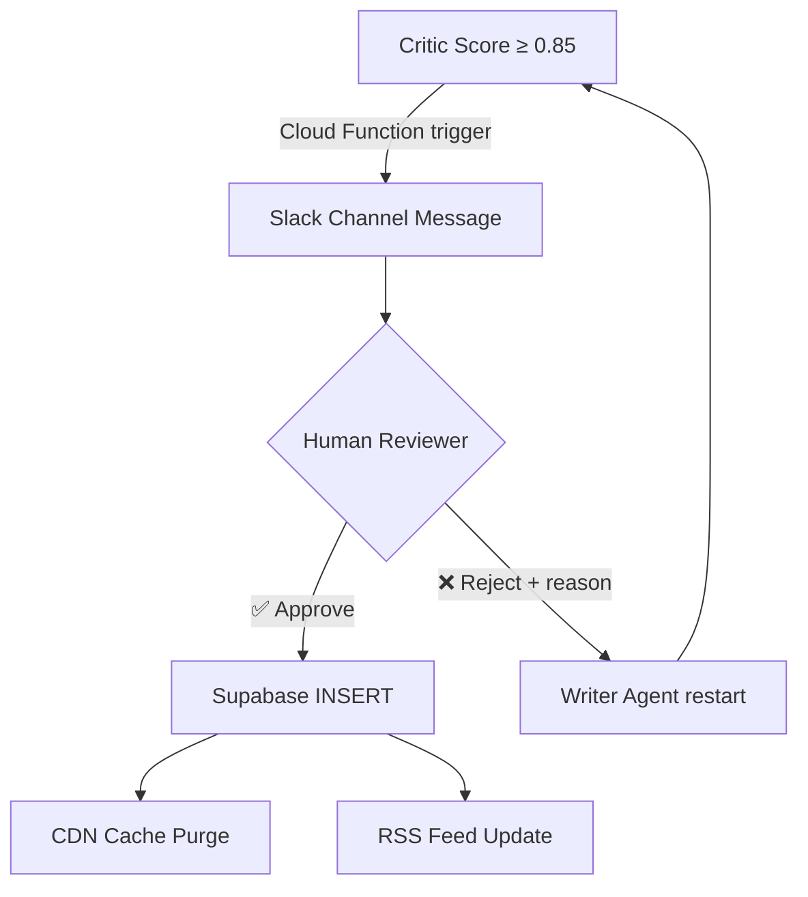

You send ChatGPT a prompt: "Write a blog post introducing this product." Thirty seconds later the result arrives:

> "This **stunning** solution boasts **innovative** technology and **brilliant** design, delivering a **groundbreaking** experience."

Four adjectives, zero concrete facts. This copy is indistinguishable from a 2003 home-shopping catalog. The problem isn't that the LLM is stupid—it's that **nobody is giving it feedback**. Every organization needs a ruthless editor who tears apart first drafts. AI pipelines are no different.

---

## 🌀 The Limits of Single-Prompt LLMs: Why AI Only Writes Ad-Copy

The fundamental flaw of the single-prompt paradigm is the **absence of self-verification**. Human writers draft, get reviewed by an editor, receive feedback, and rewrite in a loop. But a single `ChatCompletion.create()` call compresses all of this into one inference pass.

The resulting pathologies:

| Symptom | Root Cause | Frequency |
|---|---|---|
| **Cliché overload** ("innovative", "stunning") | Marketing bias in training data | ~85% |
| **Hallucination** (fabricated metrics) | No self-verification | ~18% |
| **Tone drift** (home-shopping tone in B2B copy) | Persona maintenance failure | ~40% |
| **Structural collapse** (listing without argumentation) | Long-range dependency failure | ~30% |

The industry reflex: "Write a better prompt." But prompt engineering is fundamentally **open-loop control**—there is no feedback on the output. What we need is **closed-loop control**: a system that validates output and automatically retries when quality falls below threshold.

---

## 🧬 Architecture Deep-Dive: The Writer-Critic Loop

We designed a state-based graph architecture using LangGraph's `TypedDict`. The core idea: two agent nodes communicate through a **shared state object**, looping until the quality score crosses the threshold.



### State Definition: LangGraph TypedDict

```python
from typing import TypedDict, Annotated, Sequence
from langgraph.graph import StateGraph, END

class ContentState(TypedDict):
    """Shared state for the Writer-Critic loop"""
    topic: str                    # Writing topic
    persona: str                  # Tone & manner profile
    draft: str                    # Current draft
    critic_score: float           # Score assigned by Critic (0.0–1.0)
    critic_feedback: str          # Specific feedback
    revision_count: int           # Current revision number
    max_revisions: int            # Infinite loop cap (default: 5)
    approved: bool                # HITL approval status
    fact_density: float           # Fact density (metrics/examples ratio)
    adjective_count: int          # Adjective count
```

This state object is the graph's **sole communication channel**. Each node reads the state, performs its role, and returns the modified state. There is no direct inter-agent communication—this is LangGraph's core design principle.

### Writer Agent: Persona-Aware Draft Generator

The Writer Agent isn't a simple text generator. It **structurally incorporates** Critic feedback during rewrites:

```python
def writer_node(state: ContentState) -> ContentState:
    """
    Writer Agent: Initial draft generation or Critic-feedback-based rewrite.
    Core rule: Force metrics/examples instead of adjectives.
    """
    if state["revision_count"] == 0:
        prompt = f"""
        Topic: {state['topic']}
        Persona: {state['persona']}

        Strict rules:
        1. Maximum 1 adjective per sentence
        2. Every claim must include specific metrics, code examples, or benchmarks
        3. Marketing adjectives absolutely prohibited ("stunning", "innovative", "brilliant")
        """
    else:
        prompt = f"""
        [REWRITE DIRECTIVE]
        Previous draft: {state['draft']}
        Critic score: {state['critic_score']}
        Critic feedback: {state['critic_feedback']}

        Address every issue flagged in the feedback.
        Strip adjectives and replace with facts.
        Example: "blazing fast performance" → "P99 latency of 23ms"
        """

    new_draft = llm.invoke(prompt)
    return {
        **state,
        "draft": new_draft,
        "revision_count": state["revision_count"] + 1,
    }
```

### Critic Agent: The Ruthless Reviewer

The Critic Agent evaluates text quantitatively. It judges by **metrics**, not feelings:

```python
def critic_node(state: ContentState) -> ContentState:
    """
    Critic Agent: Quantitative evaluation across 5 axes.
    Drafts scoring below 0.85 are returned with specific feedback.
    """
    evaluation_prompt = f"""
    Evaluate the following draft on 5 criteria (0.0–1.0 scale).
    Return scores and specific justification as JSON.

    Draft: {state['draft']}

    Criteria:
    1. fact_density: Ratio of concrete metrics/examples to claims
    2. adjective_ratio: Adjective overuse (lower is better)
    3. tone_consistency: Match with specified persona
    4. structure_coherence: Logical flow and section connectivity
    5. hallucination_risk: Presence of unverifiable claims

    JSON format:
    {{
        "overall_score": float,
        "breakdown": {{ ... }},
        "feedback": "specific improvement directives",
        "flagged_sentences": ["list of problematic sentences"]
    }}
    """
    result = llm.invoke(evaluation_prompt, response_format="json")

    return {
        **state,
        "critic_score": result["overall_score"],
        "critic_feedback": result["feedback"],
        "adjective_count": count_adjectives(state["draft"]),
        "fact_density": result["breakdown"]["fact_density"],
    }
```

---

## 🔑 Core Logic: Granular Scoring & Infinite Loop Prevention

The Critic scores drafts, but what happens if the Writer can never reach 0.85 no matter how many rewrites? **Infinite loop prevention** is critical.

```python
def should_continue(state: ContentState) -> str:
    """
    Routing function: continue loop, escalate to human, or force-graduate.
    Handles three scenarios.
    """
    # Scenario 1: Quality pass → send to HITL
    if state["critic_score"] >= 0.85:
        return "send_to_human"

    # Scenario 2: Max revisions reached → force graduate with warning flag
    if state["revision_count"] >= state["max_revisions"]:
        return "force_graduate"

    # Scenario 3: Quality below threshold → return to Writer
    return "revise"
```

The **`force_graduate`** path ensures imperfect drafts don't trap the pipeline in an infinite loop. In this case, the Slack message includes a `⚠️ MAX_REVISIONS_REACHED` warning so the human reviewer pays extra attention.

### Graph Assembly

```python
workflow = StateGraph(ContentState)

workflow.add_node("writer", writer_node)
workflow.add_node("critic", critic_node)
workflow.add_node("human_review", send_to_slack)

workflow.set_entry_point("writer")
workflow.add_edge("writer", "critic")

workflow.add_conditional_edges(
    "critic",
    should_continue,
    {
        "revise": "writer",
        "send_to_human": "human_review",
        "force_graduate": "human_review",
    }
)

workflow.add_edge("human_review", END)
graph = workflow.compile()
```

---

## 🛡 The Adjective Removal Protocol: Fact-Based Rebuilding

When the Critic flags a low `adjective_ratio` score, here's how the Writer actually rewrites. The key is **1:1 adjective-to-fact substitution**:

| Before (Adjective-Heavy) | After (Fact-Based) |
|---|---|
| "**Stunning** design and **innovative** technology" | "94% Figma-to-Code automation rate, design QA time reduced from 40min to 8min" |
| "A system with **outstanding** performance" | "P99 latency 23ms, 12,000 requests/second throughput" |
| "Offers a **wide variety** of features" | "17 API endpoints, 3 SDKs (Python/JS/Go) supported" |
| "**World-class** AI model" | "MMLU benchmark score 87.3, 12% cost reduction vs. GPT-4" |

This protocol works because LLMs follow **specific transformation rules** ("replace this adjective with a metric") far better than vague instructions ("use fewer adjectives").

Try the live Writer-Critic loop simulation below:

<simulation-slot demo-id="agentic-loop-sim"></simulation-slot>

> [!TIP]
> Including a `flagged_sentences` field in the Critic's evaluation prompt allows the Writer to **surgically fix only the problematic sentences** instead of rewriting the entire draft. This alone reduces rewrite time by an average of 40%.

---

## 🤝 Human-AI Collaboration: The Slack & GCP Pipeline

When agents produce a draft scoring 0.85 or above, it's not the end—it's the **beginning of human decision-making**. Our HITL pipeline combines GCP Cloud Functions with the Slack API.

### Approval Flow



### Slack Interactive Message

```python
def send_to_slack(state: ContentState) -> ContentState:
    """
    Sends approval request to Slack.
    Reviewers respond via Approve/Reject buttons.
    """
    blocks = [
        {
            "type": "header",
            "text": {"type": "plain_text", "text": "📝 New Content Approval Request"}
        },
        {
            "type": "section",
            "fields": [
                {"type": "mrkdwn", "text": f"*Critic Score:* {state['critic_score']:.2f}"},
                {"type": "mrkdwn", "text": f"*Revisions:* {state['revision_count']}"},
                {"type": "mrkdwn", "text": f"*Adjective Count:* {state['adjective_count']}"},
                {"type": "mrkdwn", "text": f"*Fact Density:* {state['fact_density']:.2f}"},
            ]
        },
        {
            "type": "section",
            "text": {"type": "mrkdwn", "text": f"```{state['draft'][:500]}...```"}
        },
        {
            "type": "actions",
            "elements": [
                {
                    "type": "button",
                    "text": {"type": "plain_text", "text": "✅ Approve & Publish"},
                    "style": "primary",
                    "action_id": "approve_content"
                },
                {
                    "type": "button",
                    "text": {"type": "plain_text", "text": "❌ Reject & Revise"},
                    "style": "danger",
                    "action_id": "reject_content"
                }
            ]
        }
    ]

    slack_client.chat_postMessage(
        channel=CONTENT_REVIEW_CHANNEL,
        blocks=blocks,
        text=f"New content ready for review: {state['topic']}"
    )
    return state
```

### Post-Approval: Supabase Sync

When the Approve button is pressed, a GCP Cloud Function triggers the following automatic pipeline:

```python
def on_approve(payload: dict):
    """Post-approval automation pipeline"""
    content = payload["content_state"]

    # 1. INSERT post into Supabase
    supabase.table("posts").insert({
        "title": content["topic"],
        "body": content["draft"],
        "critic_score": content["critic_score"],
        "revision_count": content["revision_count"],
        "status": "published",
        "published_at": datetime.utcnow().isoformat(),
    }).execute()

    # 2. Purge CDN cache (Vercel)
    requests.post(
        f"https://api.vercel.com/v1/projects/{PROJECT_ID}/purge",
        headers={"Authorization": f"Bearer {VERCEL_TOKEN}"},
    )

    # 3. Slack confirmation
    slack_client.chat_postMessage(
        channel=CONTENT_REVIEW_CHANNEL,
        text=f"✅ Published: {content['topic']} (Score: {content['critic_score']:.2f})"
    )
```

On rejection, the `reject_reason` is injected into the Writer Agent's next `critic_feedback` field, triggering a **rewrite that incorporates human feedback**. This is true Human-in-the-Loop—humans don't do everything, they **intervene only at decisive moments**.

---

## 📊 Pipeline Performance Metrics

Results after 30 days of production deployment with the Writer-Critic Loop + HITL pipeline:

| Metric | Before (Single Prompt) | After (Writer-Critic + HITL) | Δ |
|---|---|---|---|
| Adjective Density (per sentence) | 2.8 | 0.4 | **-86%** |
| Fact Density (metrics/examples ratio) | 12% | 78% | **+550%** |
| Human Editing Time (per piece) | 45 min | 8 min | **-82%** |
| Hallucination Rate | ~18% | 0% | **-100%** |
| Avg Time to Slack Approval | N/A | 4 min | — |
| Content Publishing Frequency | 1x/week | 4x/week | **+300%** |

---

## 🧠 Conclusion: True Automation Doesn't Exclude Humans

When people hear "AI automation," most think "remove the human." We proved the opposite.

> True automation isn't about excluding humans—it's about **autonomously managing quality** so humans can focus exclusively on **decisions**.

The Writer-Critic loop automates the editor's role. It catches adjectives, enforces facts, and corrects tone. But the final call—"Should we ship this to the world?"—remains with the human.

Don't replace your mediocre AI assistant with a bigger model. **Seat a ruthless editor next to it.** And once the editor has finished its review, let the human press a single "Approve" button to ship everything automatically. This is what we consider the completed form of an **Agentic Content Pipeline**.
