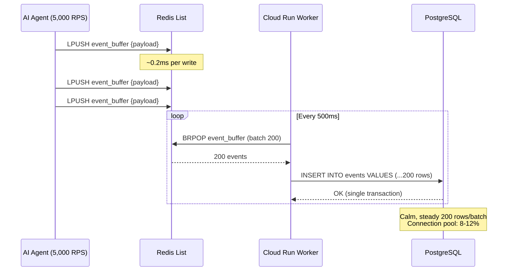

Connection Pool Exhaustion during an AI traffic surge is the silent killer of production databases. You don't get a polite warning. You get a cascading wall of `CONNECTION_REFUSED` errors at 3 AM, a Slack channel on fire, and a PostgreSQL instance locked in row-level contention so severe that even your health checks time out.

We learned this the hard way.

> **The Brutal Physics of Row-Level Locks:**
> When 2,000 concurrent AI agent requests each try to `INSERT` a row into the same PostgreSQL table, the database doesn't just slow down — it **deadlocks**. Each transaction grabs a row-level lock, waits for the connection pool, and holds resources hostage. At 5,000 RPS, your 100-connection pool isn't a pool anymore. It's a parking lot.

---

## 🔥 The Problem: PostgreSQL Wasn't Built for Write Storms

Here's what happens when your AI agent goes viral and every inference callback tries to write directly to Postgres:

| Metric | Direct Writes | Redis Write-Buffer |
|---|---|---|
| **Max sustained RPS** | ~500 | 5,000+ |
| **p99 Latency** | 800ms → timeout | 15ms (flat) |
| **Connection pool usage** | 100% (exhausted) | 8–12% |
| **Error rate at 2,000 RPS** | 35–78% | 0% |
| **Row-level lock contention** | Catastrophic | None |
| **Data loss risk** | High (rejected writes) | Zero (Redis persistence) |

The math is unforgiving. PostgreSQL's MVCC engine is optimized for **consistency**, not **throughput**. When you throw thousands of concurrent `INSERT` statements at it, each transaction acquires a row-level lock via <kbd>SELECT ... FOR UPDATE</kbd> or implicit insert locks. The connection pool becomes a bottleneck, and the database enters a death spiral of lock contention.

> Think of it this way: PostgreSQL is **The Vault** — meticulously secure, transactionally perfect, but it has a single door with a guard who checks every visitor's ID. Redis is **The Fast Cashier** — it takes your order instantly, writes it on a ticket, and batches the tickets to the vault every few seconds. When a flash mob arrives, the cashier keeps the line moving. The vault never even notices the surge.

---

## 🧪 Try It: Traffic Surge Simulator

Before we dive into the architecture, experience the difference yourself. Drag the RPS slider to 5,000 and watch what happens with Direct Writes vs. the Redis Write-Buffer:

<simulation-slot demo-id="redis-buffer-sim"></simulation-slot>

> [!TIP]
> Start with "Direct to Postgres" at 1,000+ RPS to watch the connection pool explode. Then switch to "Redis Write-Buffer" and crank it to 5,000 RPS — notice how latency stays flat at ~15ms and error rate stays at 0%.

---

## 🏗 Architecture: The Redis Stream-to-Bulk Pipeline

The core pattern is a three-stage decoupled pipeline:

1. **Hot Path** (Agent → Redis): Every write is a single <kbd>LPUSH</kbd> to a Redis List. Sub-millisecond. No locks.
2. **Worker Path** (Redis → Worker): A GCP Cloud Run worker calls <kbd>BRPOP</kbd> in a loop, batching messages.
3. **Cold Path** (Worker → PostgreSQL): The worker executes a single `INSERT ... VALUES` with 200 rows per batch.



The critical insight: **PostgreSQL never sees the spike**. It receives a steady, predictable stream of bulk inserts regardless of whether the upstream traffic is 100 RPS or 50,000 RPS. The Redis List acts as a shock absorber.

---

## 🛠 Clean Code: The Redis Stream Append Pattern

### Producer: Sub-Millisecond Write Path

```python
import redis
import json
import time

r = redis.Redis(host="redis-cluster.internal", port=6379, db=0)

def buffer_event(event: dict) -> None:
    """
    Append event to Redis List. ~0.2ms per call.
    Zero connection pool pressure on PostgreSQL.
    """
    payload = json.dumps({
        **event,
        "buffered_at": time.time(),
    })
    r.lpush("event_buffer", payload)
```

Every AI agent callback calls `buffer_event()` instead of hitting Postgres directly. The <kbd>LPUSH</kbd> operation is O(1) and completes in ~0.2ms — compared to the 15–800ms range of a direct database insert under load.

### Consumer: Bulk Flush Worker

```python
import psycopg2
from psycopg2.extras import execute_values

BATCH_SIZE = 200
POLL_TIMEOUT = 1  # seconds

def flush_worker():
    """
    Long-running worker that BRPOP batches from Redis
    and bulk-inserts to PostgreSQL.
    """
    pg = psycopg2.connect(dsn="postgresql://...")
    batch = []

    while True:
        result = r.brpop("event_buffer", timeout=POLL_TIMEOUT)
        if result:
            _, raw = result
            batch.append(json.loads(raw))

        if len(batch) >= BATCH_SIZE or (batch and not result):
            with pg.cursor() as cur:
                execute_values(
                    cur,
                    """
                    INSERT INTO events (user_id, event_type, payload, buffered_at)
                    VALUES %s
                    """,
                    [
                        (e["user_id"], e["event_type"],
                         json.dumps(e["payload"]), e["buffered_at"])
                        for e in batch
                    ],
                )
            pg.commit()
            batch.clear()
```

The <kbd>BRPOP</kbd> call blocks until data is available, then the worker accumulates up to 200 events before flushing. A single `execute_values` call with 200 rows is **dramatically** faster than 200 individual `INSERT` statements — PostgreSQL acquires one transaction lock instead of 200.

---

## 📊 Comparison: Before vs. After

| Dimension | Before: Direct DB Writes | After: Redis Write-Buffer |
|---|---|---|
| **Write latency (p99)** | 800ms → 5,000ms (timeout) | 0.2ms (Redis) + 15ms (batch flush) |
| **Postgres connections** | 100/100 (saturated) | 8–12/100 (calm) |
| **Row-level lock contention** | Cascading deadlocks | Zero — single bulk transaction |
| **Error rate at 5,000 RPS** | 78%+ `CONNECTION_REFUSED` | 0% |
| **Data durability** | Lost writes (rejected) | Redis AOF + batch confirmation |
| **Horizontal scaling** | Add Postgres replicas (&#36;&#36;&#36;) | Add Cloud Run workers (&#36;) |
| **Recovery time** | 15–30 min manual intervention | Self-healing via worker restart |

---

## 🔒 Durability Guarantees

A common objection: *"But Redis is in-memory. What if it crashes?"*

Three layers of protection:

1. **Redis AOF Persistence**: With `appendonly yes` and `appendfsync everysec`, Redis persists every write to disk within 1 second. Maximum data loss window: 1 second of events.

2. **Batch Acknowledgment**: The worker only removes events from Redis after a successful PostgreSQL `COMMIT`. If the worker crashes mid-batch, events remain in the List for the next worker to pick up.

3. **Dead Letter Queue**: Events that fail PostgreSQL insertion after 3 retries are moved to a `event_buffer_dlq` List for manual inspection.

```python
MAX_RETRIES = 3

def safe_flush(batch: list) -> None:
    for attempt in range(MAX_RETRIES):
        try:
            bulk_insert(batch)
            return
        except psycopg2.OperationalError:
            time.sleep(2 ** attempt)

    # Dead Letter Queue — never lose data
    for event in batch:
        r.lpush("event_buffer_dlq", json.dumps(event))
```

---

## 📈 When to Use This Pattern

This pattern is **not** for every write operation. Use it when:

- **Write volume is spiky**: AI inference callbacks, webhook floods, viral traffic events.
- **Writes are append-only**: Event logs, analytics, audit trails — no updates or deletes.
- **Consistency can be eventually consistent**: The data doesn't need to be queryable within 500ms of being written.
- **Connection pool is the bottleneck**: If your Postgres `max_connections` is the ceiling, this pattern lifts it.

Do **not** use this pattern for:
- Transactional writes that require immediate read-after-write consistency.
- Operations that depend on database-generated IDs in the response path.
- Low-volume CRUD operations where the complexity isn't justified.

---

## 🧠 Conclusion: Protect the Vault, Scale the Cashier

The hardest lesson in infrastructure engineering is that **your database is not your API**. PostgreSQL is extraordinary at what it does — ACID transactions, complex queries, relational integrity. But it was never designed to be a high-throughput write endpoint for thousands of concurrent AI agents.

Redis Write-Buffer inverts the pressure:

1. **Absorb** the traffic spike with O(1) <kbd>LPUSH</kbd> writes.
2. **Batch** events into chunks that PostgreSQL can digest comfortably.
3. **Flush** in single bulk transactions — one lock, 200 rows, done.
4. **Scale** by adding stateless workers, not expensive database replicas.

The result? **Zero downtime during launch.** Zero connection pool exhaustion. Zero lost writes. Your Postgres stays calm at 8% connection utilization while Redis handles the storm.

For enterprise teams shipping AI-powered products, this isn't an optimization — it's a **survival pattern**.

> The best database architecture is one where your most expensive component never knows there was a traffic spike.

<agency-cta />
