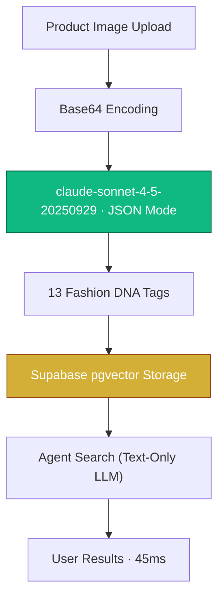

You have a fashion product image. A user asks: *"Find me something similar but more formal."* The naive approach? Send the image to a Vision-Language Model on every single search. Congratulations — you've just burned $0.03 and 6 seconds of latency for one query. Scale that to 10,000 daily searches and you're hemorrhaging $300/day on inference alone.

This is the brutal economics of real-time VLM inference in consumer-facing applications.

---

## 🔥 The Problem: Real-Time VLM Inference Doesn't Scale

Here's the uncomfortable truth that most AI product demos conveniently ignore: **Vision-Language Models are spectacularly expensive at scale.**

When Pickle AI — a personalized fashion discovery agent — first prototyped its "find similar items" feature, the architecture was simple: take the user's query, attach the product image, send both to `claude-sonnet-4-5-20250929`, and return the response.

It worked beautifully in demos. It was catastrophically uneconomical in production.

| Metric | Real-Time VLM | Structured Metadata Query |
|---|---|---|
| **Cost per search** | $0.030 | $0.0001 |
| **Cost per 10k searches** | $300.00 | $1.00 |
| **Latency** | 3.5–6.0s | 45ms |
| **Determinism** | Non-deterministic | Deterministic |
| **Cacheability** | ❌ None | ✅ Full |
| **Scaling behavior** | O(n) per user | O(1) per item |

The math is unforgiving. Every 15× cost multiplier compounds into infrastructure debt that no amount of VC funding can sustain. We needed a fundamentally different architecture.

> Running real-time VLM on every query is like hiring an elite art critic to stand in the aisle and analyze a shirt every time a customer walks by. **Vision-at-the-Gate** is having the critic write a detailed spec sheet once in the warehouse, and letting the fast database handle the customers.

---

## 🧪 Try It: Vision-at-the-Gate Simulator

Before we dive into the architecture, experience the difference yourself. Compare a real-time VLM inference call against our one-time metadata extraction pipeline:

<simulation-slot demo-id="vlm-scanner-sim"></simulation-slot>

> [!TIP]
> Click "Simulate Metadata Extraction" first to see how 13 structured Fashion DNA tags are extracted in a single pass. Then click "Reset" and try "Simulate Real-time VLM" to feel the 6-second latency penalty of naive VLM inference.

---

## 🏗 Architecture: Vision-at-the-Gate

The core insight is deceptively simple: **separate the understanding phase from the reasoning phase.**

- **Understanding** (Vision): Expensive. Requires multimodal inference. Do it **once** per item, at ingestion.
- **Reasoning** (Search/Recommendation): Cheap. Uses structured text and vectors. Do it **every time** a user searches.



The VLM is the **gatekeeper**, not the gatekeeper's gatekeeper. It runs once at the point of entry. After that, every downstream operation — search, recommendation, personalization — operates on structured metadata at text-only LLM costs.

---

## 🧬 Deep Tagging: Decomposing Fashion DNA

The `claude-sonnet-4-5-20250929` model extracts 13 structured attributes from a single image scan. We enforce output format using **JSON Structured Output** with a strict schema:

```python
import anthropic
import base64
from pathlib import Path

client = anthropic.Anthropic()

def extract_fashion_dna(image_path: str) -> dict:
    """
    Single-pass VLM extraction of 13 Fashion DNA attributes.
    Called ONCE per product at ingestion time.
    """
    image_data = base64.standard_b64encode(
        Path(image_path).read_bytes()
    ).decode("utf-8")

    response = client.messages.create(
        model="claude-sonnet-4-5-20250929",
        max_tokens=1024,
        messages=[{
            "role": "user",
            "content": [
                {
                    "type": "image",
                    "source": {
                        "type": "base64",
                        "media_type": "image/jpeg",
                        "data": image_data,
                    },
                },
                {
                    "type": "text",
                    "text": """Analyze this fashion item. Return ONLY valid JSON:
{
  "primary_color": "<dominant color>",
  "secondary_color": "<accent color or null>",
  "material": "<primary fabric>",
  "material_weight": "<light|medium|heavy>",
  "silhouette": "<fitted|relaxed|boxy|oversized>",
  "fit_type": "<slim|regular|relaxed|oversized>",
  "pattern": "<solid|striped|plaid|floral|graphic|abstract>",
  "formal_index": <float 0.0-5.0>,
  "warmth_index": <float 0.0-5.0>,
  "season": ["<applicable seasons>"],
  "occasion": ["<suitable occasions>"],
  "layer_compatibility": <float 0.0-1.0>,
  "style_tags": ["<style descriptors>"]
}"""
                },
            ],
        }],
    )
    return json.loads(response.content[0].text)
```

This single function call costs approximately **$0.003 per image** — and it only runs once. The resulting 13 tags become the item's permanent DNA in the database.

### The Four Pillars of Fashion DNA

| Pillar | Attributes | Purpose |
|---|---|---|
| **Color & Material** | `primary_color`, `secondary_color`, `material`, `material_weight` | Physical properties for filtering |
| **Style Tags** | `silhouette`, `fit_type`, `pattern`, `style_tags` | Aesthetic classification for matching |
| **TPO / Formal Index** | `formal_index`, `occasion` | Time-Place-Occasion scoring for context-aware search |
| **Warmth / Seasonality** | `warmth_index`, `season`, `layer_compatibility` | Climate-aware recommendation |

---

## 🗄 Data Architecture: pgvector at the Core

Pickle AI uses **Supabase PostgreSQL with pgvector** as the unified storage layer. Three vector types serve distinct search strategies:

| Vector Type | Dim | Use Case | Index | Status |
|---|---|---|---|---|
| `style_dna_vector` | 32 | Personalized preference modeling — user taste DNA matching | IVFFlat | ✅ Active |
| `description_embedding` | 1536 | OOTD hybrid search — text + vector composite queries | HNSW | ✅ Active |
| `image_embedding` | 512 | Visual similarity search — CLIP-based image matching | HNSW | 🗓 Roadmap |

### How the style_dna_vector is Generated

The 13 categorical/numerical tags are encoded into a compact 32-dimensional vector for lightning-fast cosine similarity:

```python
def encode_style_dna(tags: dict) -> list[float]:
    """
    Encode Fashion DNA tags into a 32-dim vector.
    Numeric fields map directly; categoricals use learned embeddings.
    """
    vector = []

    # Numeric fields (normalized 0-1)
    vector.append(tags["formal_index"] / 5.0)
    vector.append(tags["warmth_index"] / 5.0)
    vector.append(tags["layer_compatibility"])

    # Material weight encoding
    weight_map = {"light": 0.2, "medium": 0.5, "heavy": 0.8}
    vector.append(weight_map.get(tags["material_weight"], 0.5))

    # Silhouette encoding (4-dim one-hot)
    sil_map = {"fitted": [1,0,0,0], "relaxed": [0,1,0,0],
               "boxy": [0,0,1,0], "oversized": [0,0,0,1]}
    vector.extend(sil_map.get(tags["silhouette"], [0,0,0,0]))

    # ... remaining 24 dims from color/material/pattern embeddings
    vector.extend(get_color_embedding(tags["primary_color"]))  # 8-dim
    vector.extend(get_material_embedding(tags["material"]))    # 8-dim
    vector.extend(get_pattern_embedding(tags["pattern"]))      # 8-dim

    return vector  # 32-dim total
```

### Hybrid Search Query

The agent's search pipeline combines structured filtering with vector similarity:

```sql
SELECT
  p.id,
  p.title,
  p.fashion_dna,
  1 - (p.style_dna_vector <=> $1) AS style_similarity,
  1 - (p.description_embedding <=> $2) AS text_similarity
FROM products p
WHERE
  p.fashion_dna->>'material' = 'denim'
  AND (p.fashion_dna->>'formal_index')::float BETWEEN 1.5 AND 3.5
  AND p.fashion_dna->>'season' ? 'fall'
ORDER BY
  0.6 * (1 - (p.style_dna_vector <=> $1)) +
  0.4 * (1 - (p.description_embedding <=> $2)) DESC
LIMIT 20;
```

The beauty: structured `WHERE` clauses handle hard filters (material, season), while `ORDER BY` blends vector similarity scores. Zero VLM calls. Sub-50ms response.

---

## 📊 The Economics: 90% Cost Reduction

Let's do the math on a production deployment with 50,000 product images and 10,000 daily searches.

**One-Time Ingestion Cost (Vision-at-the-Gate):**

| Line Item | Calculation | Cost |
|---|---|---|
| VLM extraction | 50,000 images × $0.003/image | $150 |
| Embedding generation | 50,000 × $0.0001/embed | $5 |
| **Total one-time cost** | | **$155** |

**Daily Operational Cost Comparison:**

| Strategy | Cost per 10k Searches | Monthly (300k) | Annual |
|---|---|---|---|
| Real-time VLM | $300/day | $9,000 | **$108,000** |
| Vision-at-the-Gate | $1/day | $30 | **$360** |
| **Savings** | | | **$107,640 (99.7%)** |

The $155 one-time ingestion cost pays for itself in **12 hours** of production traffic. After that, every search costs 300× less than the naive approach.

> "In AI architecture, Vision is for understanding, but Metadata is for scaling."

---

## 🗺 Roadmap: From Text-DNA to Predictive Curation

Pickle AI's search infrastructure is evolving through four phases:

**Phase 1 — Text-DNA Search (Current):** VLM-extracted metadata powers structured filtering + text-based agent reasoning. All 13 Fashion DNA attributes are queryable.

**Phase 2 — Hybrid Search (Next):** pgvector cosine similarity combined with BM25 text scoring. The `description_embedding` (1536-dim) enables semantic "find me something like this but warmer" queries.

**Phase 3 — Visual Similarity (HNSW Index):** CLIP-based `image_embedding` (512-dim) enables "show me items that look like this photo" without any text input. HNSW index for sub-10ms ANN search.

**Phase 4 — Predictive Curation:** User behavior patterns feed back into the `style_dna_vector`, enabling proactive recommendations before the user even searches. The system predicts what you want to wear tomorrow.

---

## 🧠 Conclusion: Build for Scale from Day One

The temptation with VLMs is to treat them as runtime services — always on, always analyzing. But at consumer scale, this mental model bankrupts you.

**Vision-at-the-Gate** inverts the paradigm:

1. **Scan once** at the warehouse door with the most capable VLM available.
2. **Persist the DNA** as structured metadata + vectors in pgvector.
3. **Reason cheaply** with text-only LLMs at search time.
4. **Scale freely** — adding users doesn't increase VLM costs.

The VLM is the most expensive employee on your team. Don't make it answer every customer question. Let it write the spec sheet once, and let the database do the rest.

> True cost optimization isn't about finding cheaper models — it's about **calling expensive models fewer times.**

<agency-cta />
