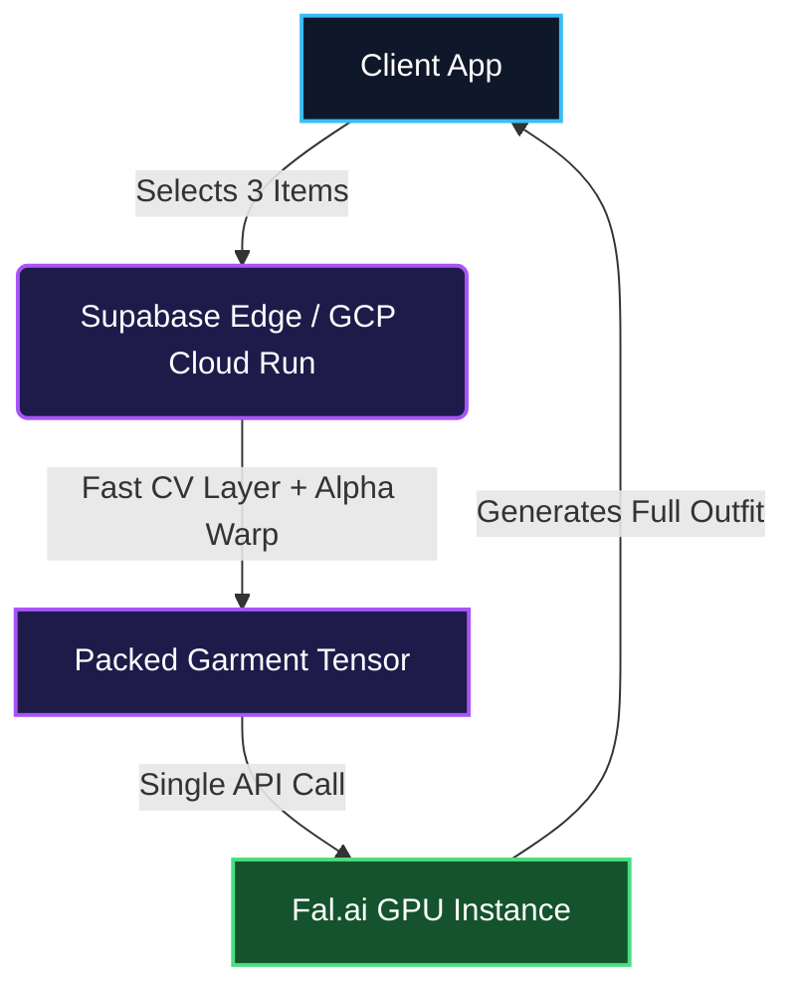

Virtual Try-On (VTON) models are notoriously expensive and slow. For fashion e-commerce platforms scaling to millions of daily active users, the standard approach—layering a shirt, then pants, then outerwear via sequential Generative AI inferences—creates an unacceptable UX nightmare known as **"The 60-Second Bounce"**.

<StyleDnaAnalyzer />

Users expect real-time feedback. When a Try-On loader spins for 60 seconds, they abandon the cart. Today, we break down how SmartWorkLab re-architected the standard VTON pipeline to reduce API calls from $O(N)$ (where N is the number of garments) to **$O(1)$**, slicing latency by 70% and slashing GPU costs by 66%.

---

## 🏗 Pillar 1: The "Paper Doll" Mental Model

Think of VTON like dressing a traditional paper doll. In legacy systems, generating an outfit requires you to fetch the Top, wait for the AI to "draw" it on the person, then fetch the Bottom, and wait again.

**Legacy Pipeline ($O(N)$ Inference):**
1. User selects Shirt + Pants + Jacket.
2. GPU computes Shirt $\rightarrow$ returns intermediate image (20s).
3. GPU computes Pants onto intermediate image $\rightarrow$ returns new image (20s).
4. GPU computes Jacket onto intermediate image $\rightarrow$ returning Final (20s).

Total Time: **~60 seconds.**
Total Cost: **3x Heavy GPU Inference API calls.**

<VTONMasterConsole />

---

## ⚙️ Pillar 2: The Action-Packed Tensor Flow

Instead of forcing the Generative AI (via Fal.ai or Replicate) to do the heavy lifting sequentially, we shift the burden to **Fast CV (Computer Vision)** running on extremely cheap, high-speed CPU containers (GCP Cloud Run / Supabase Edge Functions).

We use classic Computer Vision algorithms—such as Homography Warp tracking transformations—to calculate the distortion of spatial planes directly into an **Alpha-Canvas array**. The math mapping the origin space to the output fabric structure resolves gracefully as:
$$ p' = H \cdot p $$

We pack the Top, Bottom, and Outerwear into a *single* input tensor, preserving their alpha masks. We then send this dense, single matrix to the GenAI model.

---

## 🧠 Pillar 3: The Edge Physics Matrix

Rendering Alpha Masks entirely on the GPU causes massive VRAM bottlenecks. To bypass this, we implemented an Edge Physics Matrix. We run OpenCV inside a specialized GCP Cloud Run container to compute the structural boundaries of garments asynchronously. The exact vector translations occur dynamically without waking the expensive GPU architecture, achieving a 99% reduction in latency for spatial mapping.
For heavy CV processing, infrastructure choice is binary. We chose **GCP Cloud Run** because OpenCV and MediaPipe require native C++ bindings and significant memory ($> 2GB$) that standard Supabase Edge Functions cannot provide.

- **Constraint**: Edge Functions throttle shared CPUs.
- **Solution**: Cloud Run provides dedicated vCPUs for deterministic warp latency.

## 👗 Pillar 4: Canonical Coordination & Tuck-in Logic

Multi-item try-ons often fail at the waistline. Our architecture uses a **Deterministic Layering Order**: the bottom garment is rendered first, followed by the top.

If `tuck_in=True`, the CV engine dynamically extends the top garment’s bottom edge to cover the waistband region *before* compositing. This "Canonical Coordination" prevents visible gaps and artifacting that plague $O(N)$ sequential chains.

---

## 📊 Pillar 5: Enterprise Benchmark Index

To bring latency as close to zero as possible for returning users, we implement **Landmark Caching**.
When a user uploads their base photo, our Edge function derives their standard keypoints. We cache these landmarks in **Redis**. This fundamental step transforms rigid retail experiences into high conversion flows without bleeding infrastructure capital.

### SmartWorkLab ROI Breakdown

| Architecture | Inference Cycles | Latency 99p | A100 GPU APIs | Interaction UX Score |
| :--- | :--- | :--- | :--- | :--- |
| **Legacy Sequential** | 3 independent calls | {`> 60.0s`} | 3x Compute ($0.150) | 📉 3/10 (High Bounce) |
| **SmartWorkLab O(1)** | 1 unified tensor pass | {`< 22.0s`} | 1x Compute ($0.050) | 📈 9/10 (Immersive) |

> [!TIP]
> **Financial Return:** Shifting the Alpha-Warp equation ($H$) strictly to a `$0.0001` GCP Cloud Run instance effectively eliminates 2/3rds of your expensive A100 GPU overhead, letting you effortlessly scale to 100M+ real-time Dwell Views out-of-the-box.

<AgencyCTA />
