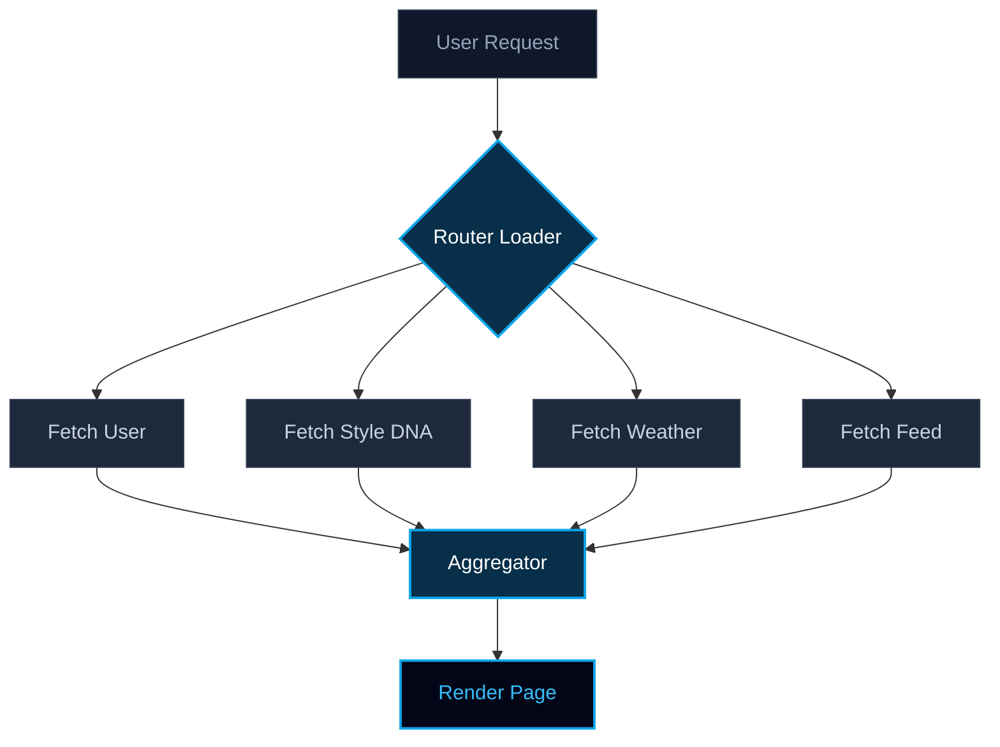

## 1. The Problem: The Invisible Chain of Latency

In modern AI-driven applications like **Pickle AI**, the user experience is under constant attack from latency. While our generative models are crunching images (taking up to 10 seconds), the frontend often compounds the wait time by fetching metadata sequentially.

This is the **Sequential Waterfall Anti-Pattern**.

Imagine a user landing on a personalized dashboard. The system needs to:
1. Identify the user.
2. Fetch their Style DNA.
3. Fetch weather for their location.
4. Fetch the trending feed.

If each takes 100ms, the user waits 400ms before the "loading" spinner even disappears. This is **Linear Scaling Latency** $$T = t_1 + t_2 + t_3 + ...$$

---

## 2. The Mental Model: The Single Chef vs. The Kitchen Brigade

Think of a traditional web app like a **Single Chef**.
The chef boils the water, *then* cuts the onions, *then* sears the steak. If each task takes 5 minutes, dinner is served in 15 minutes.

**Ghost Speed Architecture** is a **Professional Kitchen Brigade**.
One chef boils water, another cuts onions, and a third sears the steak—all at the same time. Dinner is served in 5 minutes (the time of the longest task).

---

## 3. The Insight: Parallel Execution via React Router v7

React Router v7 loaders provide a "Pre-render execution sandbox." Instead of letting components trigger fetches (which causes waterfalls), we move all I/O to the **Routing Level**.

By using `Promise.all`, we saturate the database connection pool instantly.



---

## 4. The Execution: Saturating the Connection Pool

Here is how we implement the "Brigade" in code. We don't just fetch; we orchestrate.

```typescript
// /app/routes/lab.ghost-speed.tsx
export async function loader({ request }) {
  const startTime = performance.now();

  // Detaching 13 concurrent promises
  const [profile, dna, weather, feed, social, analytics] = await Promise.all([
    fetchUserProfile(request),
    getStyleDNA(request),
    getLocalWeather(request),
    getTrendingFeed(request),
    // ... 9 more concurrent calls
  ]);

  const endTime = performance.now();
  console.log(`Ghost Speed execution: ${endTime - startTime}ms`);

  return data({ profile, dna, weather, feed });
}
```

By shifting from $$O(N)$$ to $$O(\max(N))$$, our latency profile changed from a staircase to a flat line. Whether we fetch 3 items or 13, the cost remains the time of the single slowest query.

---

## 5. Interactive Simulation: Experience the Difference

Use the simulator below to toggle between Waterfall and Ghost Speed. Notice how the "Total Latency" bar behaves when the network is parallelized.

<simulation-slot demo-id="ghost-speed" title="Parallelization Simulator"></simulation-slot>

---

## 6. The B2B ROI: Why This Matters for Your Business

In the enterprise world, 100ms of latency equals a 1% drop in conversion. For a platform aiming for 100M DAU, that is millions of dollars in lost revenue.

At SmartWorkLab, we don't just build "features." We build Infrastructure.

- **Reduced Bounce Rates**: Users see content instantly.
- **Lower Compute Costs**: Efficient connection pooling reduces server idle time.
- **Scalability**: Your app stays fast even as its complexity grows.

Ready to upgrade your infrastructure from a Single Chef to a Global Brigade?

<br/>
<a href="/services" className="inline-block bg-cyan-500 hover:bg-cyan-400 text-slate-900 font-bold py-3 px-6 rounded-full transition-colors shadow-[0_0_15px_rgba(6,182,212,0.5)]">
  Get an Infrastructure Audit
</a>
