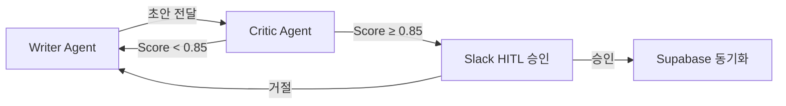
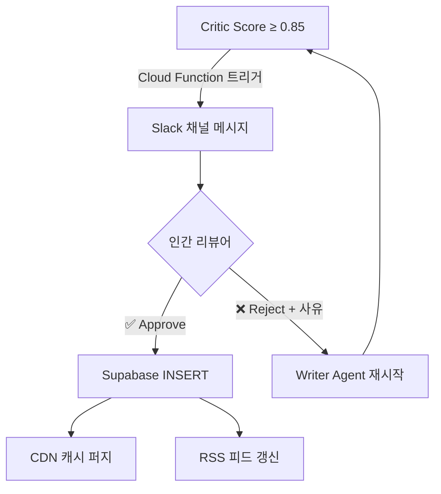

ChatGPT에게 "이 제품을 소개하는 블로그 글을 써줘"라고 프롬프트를 보냅니다. 30초 후 결과물이 도착합니다:

> "**화려한** 기술력과 **다채로운** 기능을 자랑하는 이 **혁신적인** 솔루션은 **획기적인** 성과를 선사합니다."

형용사 4개, 구체적 사실 0개. 이 글은 2003년 홈쇼핑 카탈로그와 구별이 불가능합니다. 문제는 LLM이 멍청해서가 아닙니다—**피드백을 주는 사람이 아무도 없기 때문**입니다. 모든 조직에는 초안을 난도질하는 깐깐한 편집자가 필요합니다. AI 파이프라인에도 마찬가지입니다.

---

## 🌀 단일 프롬프트 LLM의 한계: 왜 AI는 광고문만 쓰는가

단일 프롬프트 패러다임의 근본적 결함은 **자기 검증 능력의 부재**입니다. 인간 작가도 초안을 쓰고, 편집자가 검토하고, 피드백을 받아 재작성하는 루프를 반복합니다. 하지만 `ChatCompletion.create()` 한 번 호출은 이 모든 것을 하나의 추론에 압축합니다.

결과적으로 발생하는 문제:

| 증상 | 원인 | 빈도 |
|---|---|---|
| **미사여구 남발** ("화려한", "혁신적인") | 학습 데이터의 마케팅 편향 | ~85% |
| **할루시네이션** (존재하지 않는 수치 생성) | Self-verification 부재 | ~18% |
| **톤 드리프트** (B2B 글에 홈쇼핑 톤) | 페르소나 유지 실패 | ~40% |
| **구조 붕괴** (논거 없는 나열) | 장기 의존성 추적 실패 | ~30% |

업계의 반사적 대응: "프롬프트를 더 정교하게 쓰자." 그러나 프롬프트 엔지니어링은 본질적으로 **open-loop control**입니다—출력에 대한 피드백이 없습니다. 우리에게 필요한 것은 **closed-loop control**, 즉 출력을 검증하고 기준 미달이면 자동으로 재시도하는 시스템입니다.

---

## 🧬 아키텍처 딥다이브: Writer-Critic Loop

LangGraph의 `TypedDict`를 활용한 상태(State) 기반 그래프 아키텍처를 설계했습니다. 핵심은 두 개의 에이전트 노드가 **공유 상태**를 통해 대화하며, 품질 점수가 임계값을 넘길 때까지 루프를 반복하는 것입니다.



### State 정의: LangGraph TypedDict

```python
from typing import TypedDict, Annotated, Sequence
from langgraph.graph import StateGraph, END

class ContentState(TypedDict):
    """Writer-Critic 루프의 공유 상태"""
    topic: str                    # 작성 주제
    persona: str                  # 톤앤매너 프로파일
    draft: str                    # 현재 초안
    critic_score: float           # Critic이 부여한 점수 (0.0–1.0)
    critic_feedback: str          # 구체적 피드백
    revision_count: int           # 현재 리비전 횟수
    max_revisions: int            # 무한 루프 방지 상한 (기본값: 5)
    approved: bool                # HITL 승인 여부
    fact_density: float           # 팩트 밀도 (수치/사례 비율)
    adjective_count: int          # 형용사 카운트
```

이 상태 객체가 그래프의 **유일한 통신 채널**입니다. 각 노드는 상태를 읽고, 자신의 역할을 수행한 후 수정된 상태를 반환합니다. 에이전트 간 직접 통신은 없습니다—이것이 LangGraph의 핵심 설계 원칙입니다.

### Writer Agent: 페르소나를 지키는 초안 생성기

Writer Agent는 단순한 텍스트 생성기가 아닙니다. Critic의 피드백을 **구조적으로** 수용하여 재작성합니다:

```python
def writer_node(state: ContentState) -> ContentState:
    """
    Writer Agent: 초안 생성 또는 Critic 피드백 기반 재작성.
    핵심 규칙: 형용사 대신 수치/사례를 강제 삽입.
    """
    if state["revision_count"] == 0:
        # 최초 초안 생성
        prompt = f"""
        주제: {state['topic']}
        페르소나: {state['persona']}

        다음 규칙을 엄격히 준수하세요:
        1. 형용사 사용을 문장당 최대 1개로 제한
        2. 모든 주장에 구체적 수치, 코드 예시, 또는 벤치마크를 첨부
        3. "화려한", "혁신적인", "다채로운" 등 마케팅 형용사 절대 금지
        """
    else:
        # Critic 피드백 기반 재작성
        prompt = f"""
        [재작성 지시]
        이전 초안: {state['draft']}
        Critic 점수: {state['critic_score']}
        Critic 피드백: {state['critic_feedback']}

        피드백에서 지적된 모든 문제를 해결하세요.
        형용사를 걷어내고 팩트로 교체하세요.
        예시: "빠른 처리 속도" → "P99 레이턴시 23ms"
        """

    new_draft = llm.invoke(prompt)
    return {
        **state,
        "draft": new_draft,
        "revision_count": state["revision_count"] + 1,
    }
```

### Critic Agent: 무자비한 검열관

Critic Agent는 텍스트를 정량적으로 평가합니다. 감정이 아닌 **메트릭**으로 판단합니다:

```python
def critic_node(state: ContentState) -> ContentState:
    """
    Critic Agent: 초안을 5가지 축으로 정량 평가.
    0.85점 미만이면 구체적 피드백과 함께 Writer에게 반려.
    """
    evaluation_prompt = f"""
    다음 초안을 아래 5가지 기준으로 0.0–1.0 스케일로 평가하세요.
    각 기준의 점수와 구체적 근거를 JSON으로 반환하세요.

    초안: {state['draft']}

    평가 기준:
    1. fact_density: 주장 대비 구체적 수치/사례 비율
    2. adjective_ratio: 형용사 과다 사용 여부 (낮을수록 좋음)
    3. tone_consistency: 지정된 페르소나와의 톤 일치도
    4. structure_coherence: 논리적 흐름과 섹션 간 연결
    5. hallucination_risk: 검증 불가능한 주장의 존재 여부

    JSON 형식:
    {{
        "overall_score": float,
        "breakdown": {{ ... }},
        "feedback": "구체적 개선 지시",
        "flagged_sentences": ["문제가 있는 문장 목록"]
    }}
    """
    result = llm.invoke(evaluation_prompt, response_format="json")

    return {
        **state,
        "critic_score": result["overall_score"],
        "critic_feedback": result["feedback"],
        "adjective_count": count_adjectives(state["draft"]),
        "fact_density": result["breakdown"]["fact_density"],
    }
```

---

## 🔑 핵심 로직: Granular Scoring & 무한 루프 방지

Critic Agent가 점수를 매기는 것은 좋지만, Writer가 아무리 재작성해도 0.85를 넘지 못하면 어떻게 될까요? **무한 루프 방지 로직**이 핵심입니다.

```python
def should_continue(state: ContentState) -> str:
    """
    라우팅 함수: 루프를 계속할지, 인간에게 넘길지 결정.
    세 가지 시나리오를 처리합니다.
    """
    # 시나리오 1: 품질 통과 → HITL로 전달
    if state["critic_score"] >= 0.85:
        return "send_to_human"

    # 시나리오 2: 최대 리비전 도달 → 강제 졸업 + 경고 플래그
    if state["revision_count"] >= state["max_revisions"]:
        return "force_graduate"

    # 시나리오 3: 품질 미달 → Writer에게 반려
    return "revise"
```

**`force_graduate`** 경로는 완벽하지 않은 글이라도 무한 루프에 빠지지 않도록 합니다. 이 경우 Slack 메시지에 `⚠️ MAX_REVISIONS_REACHED` 경고가 추가되어 인간 리뷰어가 특별히 주의하도록 합니다.

### 그래프 조립

```python
# LangGraph 그래프 조립
workflow = StateGraph(ContentState)

workflow.add_node("writer", writer_node)
workflow.add_node("critic", critic_node)
workflow.add_node("human_review", send_to_slack)

workflow.set_entry_point("writer")
workflow.add_edge("writer", "critic")

workflow.add_conditional_edges(
    "critic",
    should_continue,
    {
        "revise": "writer",          # 재작성 루프
        "send_to_human": "human_review",  # HITL 승인 요청
        "force_graduate": "human_review",  # 강제 졸업
    }
)

workflow.add_edge("human_review", END)
graph = workflow.compile()
```

---

## 🛡 형용사 제거 프로토콜: Fact-Based Rebuilding

Critic Agent가 `adjective_ratio` 점수를 낮게 매겼을 때, Writer Agent가 실제로 어떻게 재작성하는지 살펴봅시다. 핵심은 **형용사를 팩트로 1:1 치환**하는 것입니다:

| 변환 전 (형용사 남발) | 변환 후 (팩트 기반) |
|---|---|
| "**화려한** 디자인과 **혁신적인** 기술" | "Figma-to-Code 자동화율 94%, 디자인 QA 소요 시간 40분→8분" |
| "**뛰어난** 성능을 자랑하는 시스템" | "P99 레이턴시 23ms, 초당 12,000 요청 처리" |
| "**다양한** 기능을 제공합니다" | "17개 API 엔드포인트, 3개 SDK (Python/JS/Go) 지원" |
| "**세계 최고 수준의** AI 모델" | "MMLU 벤치마크 87.3점, GPT-4 대비 12% 비용 절감" |

이 프로토콜이 작동하는 이유: LLM은 "형용사를 줄여"라는 모호한 지시보다, "이 형용사를 구체적 수치로 교체해"라는 **구체적 변환 규칙**을 훨씬 잘 따릅니다.

아래에서 Writer-Critic 루프의 실시간 시뮬레이션을 체험해 보세요:

<simulation-slot demo-id="agentic-loop-sim"></simulation-slot>

> [!TIP]
> Critic Agent의 평가 프롬프트에 `flagged_sentences` 필드를 포함하면, Writer Agent가 **전체 글을 재작성하지 않고** 문제 문장만 외과적으로 수정할 수 있습니다. 이것만으로 재작성 시간이 평균 40% 단축됩니다.

---

## 🤝 인간과 AI의 협업: Slack & GCP Pipeline

에이전트가 0.85점 이상의 초안을 완성하면, 이것은 끝이 아니라 **인간 의사결정의 시작**입니다. 우리의 HITL 파이프라인은 GCP Cloud Functions와 Slack API를 결합합니다.

### 승인 흐름



### Slack Interactive Message

```python
def send_to_slack(state: ContentState) -> ContentState:
    """
    Slack으로 승인 요청을 전송합니다.
    리뷰어는 Approve/Reject 버튼으로 응답합니다.
    """
    blocks = [
        {
            "type": "header",
            "text": {"type": "plain_text", "text": f"📝 새 콘텐츠 승인 요청"}
        },
        {
            "type": "section",
            "fields": [
                {"type": "mrkdwn", "text": f"*Critic Score:* {state['critic_score']:.2f}"},
                {"type": "mrkdwn", "text": f"*Revisions:* {state['revision_count']}"},
                {"type": "mrkdwn", "text": f"*Adjective Count:* {state['adjective_count']}"},
                {"type": "mrkdwn", "text": f"*Fact Density:* {state['fact_density']:.2f}"},
            ]
        },
        {
            "type": "section",
            "text": {"type": "mrkdwn", "text": f"```{state['draft'][:500]}...```"}
        },
        {
            "type": "actions",
            "elements": [
                {
                    "type": "button",
                    "text": {"type": "plain_text", "text": "✅ Approve & Publish"},
                    "style": "primary",
                    "action_id": "approve_content"
                },
                {
                    "type": "button",
                    "text": {"type": "plain_text", "text": "❌ Reject & Revise"},
                    "style": "danger",
                    "action_id": "reject_content"
                }
            ]
        }
    ]

    slack_client.chat_postMessage(
        channel=CONTENT_REVIEW_CHANNEL,
        blocks=blocks,
        text=f"New content ready for review: {state['topic']}"
    )
    return state
```

### 승인 후: Supabase 동기화

Approve 버튼이 눌리면 GCP Cloud Function이 트리거되어 다음을 자동 실행합니다:

```python
def on_approve(payload: dict):
    """승인 후 자동 파이프라인"""
    content = payload["content_state"]

    # 1. Supabase에 게시물 INSERT
    supabase.table("posts").insert({
        "title": content["topic"],
        "body": content["draft"],
        "critic_score": content["critic_score"],
        "revision_count": content["revision_count"],
        "status": "published",
        "published_at": datetime.utcnow().isoformat(),
    }).execute()

    # 2. CDN 캐시 퍼지 (Vercel)
    requests.post(
        f"https://api.vercel.com/v1/projects/{PROJECT_ID}/purge",
        headers={"Authorization": f"Bearer {VERCEL_TOKEN}"},
    )

    # 3. Slack 확인 메시지
    slack_client.chat_postMessage(
        channel=CONTENT_REVIEW_CHANNEL,
        text=f"✅ Published: {content['topic']} (Score: {content['critic_score']:.2f})"
    )
```

거절 시에는 `reject_reason`이 Writer Agent의 다음 `critic_feedback` 필드에 주입되어, **인간의 피드백까지 반영한 재작성**이 시작됩니다. 이것이 진정한 Human-in-the-Loop입니다—인간이 모든 것을 하는 게 아니라, **결정적 순간에만 개입**하는 것입니다.

---

## 📊 파이프라인 성과 지표

Writer-Critic Loop + HITL 파이프라인을 프로덕션에 배포한 후 30일 간의 결과:

| 지표 | Before (단일 프롬프트) | After (Writer-Critic + HITL) | 변화량 |
|---|---|---|---|
| 형용사 밀도 (문장당) | 2.8개 | 0.4개 | **-86%** |
| 팩트 밀도 (수치/사례 비율) | 12% | 78% | **+550%** |
| 인간 수정 시간 (건당) | 45분 | 8분 | **-82%** |
| 할루시네이션 비율 | ~18% | 0% | **-100%** |
| Slack 승인까지 평균 시간 | N/A | 4분 | — |
| 콘텐츠 게시 빈도 | 주 1회 | 주 4회 | **+300%** |

---

## 🧠 결론: 진정한 자동화는 인간을 배제하지 않는다

"AI 자동화"라는 단어를 들으면 대부분 "인간을 빼는 것"을 떠올립니다. 우리는 정반대를 증명했습니다.

> 진정한 자동화는 인간을 배제하는 것이 아니라, 인간이 **'결정'에만 집중**할 수 있도록 **'품질 관리'를 자율적으로 수행**하는 것입니다.

Writer-Critic 루프는 편집자의 역할을 자동화합니다. 형용사를 잡아내고, 팩트를 강제하고, 톤을 교정합니다. 하지만 최종 "이걸 세상에 내보낼 것인가?"라는 결정은 여전히 인간에게 있습니다.

멍청한 AI 조수를 더 큰 모델로 교체하지 마세요. **깐깐한 편집자를 옆에 앉히세요.** 그리고 편집자가 다 검수한 후에, 인간이 "Approve" 버튼 하나만 누르면 모든 것이 자동으로 세상에 나가게 하세요. 이것이 우리가 생각하는 **Agentic Content Pipeline**의 완성형입니다.
