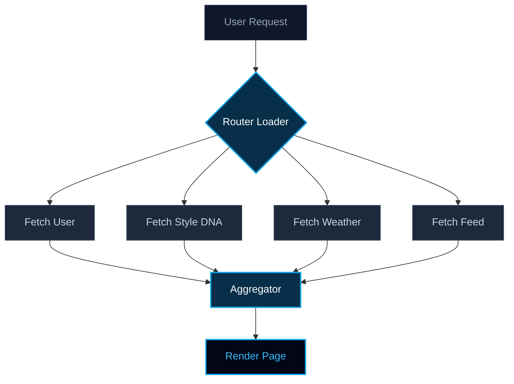

## 1. 문제 상황: 눈에 보이지 않는 레이턴시의 사슬

**Pickle AI**와 같은 최신 AI 기반 애플리케이션에서, 사용자 경험은 끊임없이 레이턴시의 위협을 받습니다. 생성형 모델이 이미지를 처리하는 데 최대 10초가 걸리는 동안, 프론트엔드는 종종 메타데이터를 순차적으로 페칭함으로써 대기 시간을 더욱 악화시킵니다.

이것이 바로 **순차적 워터폴 안티패턴(Sequential Waterfall Anti-Pattern)** 입니다.

사용자가 개인화된 대시보드에 접속한다고 가정해봅시다. 시스템은 다음 작업을 수행해야 합니다:
1. 사용자 식별
2. Style DNA 페칭
3. 사용자 위치의 날씨 정보 페칭
4. 트렌딩 피드 페칭

각 작업에 100ms가 소요된다면, 사용자는 로딩 스피너가 사라지는 것을 보기 위해 최소 400ms를 기다려야 합니다. 이를 **선형적 확장 레이턴시(Linear Scaling Latency)** 라고 부릅니다: $$T = t_1 + t_2 + t_3 + ...$$

---

## 2. 멘탈 모델: 1인 셰프 vs. 효율적인 주방 여단(Kitchen Brigade)

전통적인 웹 앱을 **1인 셰프**라고 생각해 보세요.
물 끓이기, 양파 썰기, 스테이크 굽기를 순차적으로 진행합니다. 각 작업에 5분이 걸린다면 저녁 식사는 15분 후에 완성됩니다.

반면, **Ghost Speed Architecture**는 **전문적인 주방 여단(Kitchen Brigade)** 입니다.
한 셰프가 물을 끓이는 동시에 다른 셰프는 양파를 썰고, 또 다른 셰프는 스테이크를 굽습니다. 이 경우, 저녁 식사는 가장 오래 걸리는 작업의 소요 시간인 5분 만에 테이블에 오릅니다.

---

## 3. 핵심 인사이트: React Router v7을 활용한 병렬 실행

React Router v7의 Loader는 "프리렌더링 실행 샌드박스"를 제공합니다. 개별 컴포넌트 내부에서 페칭을 트리거하여 워터폴을 발생시키는 대신, 모든 I/O 작업을 **라우팅 레벨(Routing Level)** 로 끌어올립니다.

`Promise.all`을 사용하여 데이터베이스 커넥션 풀을 즉각적으로 최대한 활용합니다.



---

## 4. 실행: 커넥션 풀의 극대화

주방 여단을 코드로 구현하는 방법입니다. 단순히 데이터를 페칭하는 데 그치지 않고 일련의 오케스트레이션을 수행합니다.

```typescript
// /app/routes/lab.ghost-speed.tsx
export async function loader({ request }) {
  const startTime = performance.now();

  // 13개의 동시 프로미스 분리
  const [profile, dna, weather, feed, social, analytics] = await Promise.all([
    fetchUserProfile(request),
    getStyleDNA(request),
    getLocalWeather(request),
    getTrendingFeed(request),
    // ... 9개의 추가적인 동시 호출
  ]);

  const endTime = performance.now();
  console.log(`Ghost Speed execution: ${endTime - startTime}ms`);

  return data({ profile, dna, weather, feed });
}
```

복잡도를 $$O(N)$$ 구조에서 $$O(\max(N))$$ 로 전환함으로써, 계단식이었던 레이턴시 프로파일이 평탄화됩니다. 3개의 아이템을 페칭하든 13개를 페칭하든, 총 소요 시간은 가장 느린 단일 쿼리의 실행 시간과 동일합니다.

---

## 5. 인터랙티브 시뮬레이션: 차이를 직접 경험하세요

아래 시뮬레이터를 사용하여 기존의 워터폴 방식과 Ghost Speed 방식을 비교해보세요. 네트워크가 병렬화될 때 최하단의 "Total Latency (총 지연 시간)"이 어떻게 극적으로 변하는지 확인해볼 수 있습니다.

<simulation-slot demo-id="ghost-speed" title="병렬 페칭 시뮬레이터(Parallelization Simulator)"></simulation-slot>

---

## 6. B2B 관점의 ROI: 기업 비즈니스에 이것이 중요한 이유

엔터프라이즈 환경에서 100ms의 레이턴시는 실질적인 전환율 1% 하락과 직결됩니다. DAU 1억 명을 목표로 하는 플랫폼이라면, 이는 수백만 달러의 매출 손실을 의미합니다.

SmartWorkLab은 단순한 "기능"을 개발하지 않습니다. 우리는 인프라를 구축합니다.

- **이탈률 감소**: 사용자가 대기 없이 콘텐츠를 즉시 확인합니다.
- **컴퓨팅 비용 절감**: 효율적인 커넥션 풀링으로 서버의 유휴 시간을 단축합니다.
- **확장성 제고**: 시스템 복잡도가 증가하더라도 애플리케이션의 쾌적한 속도를 유지합니다.

인프라를 1인 셰프에서 '글로벌 주방 여단'으로 업그레이드할 준비가 되셨습니까?

<br/>
