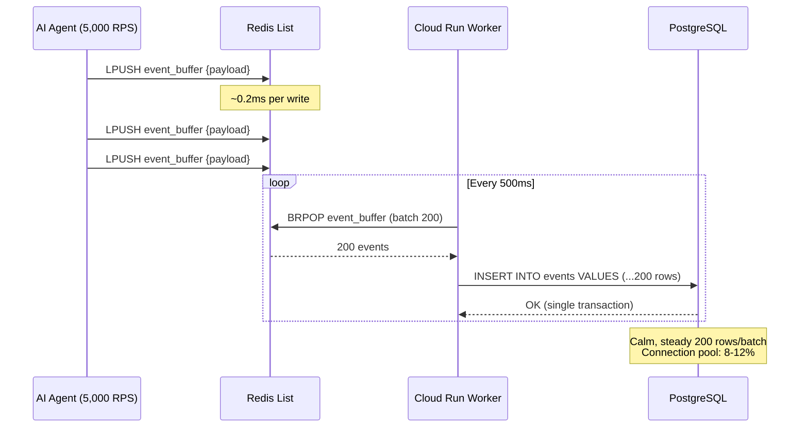

AI 트래픽 급증 시 커넥션 풀 고갈(Connection Pool Exhaustion)은 프로덕션 데이터베이스의 조용한 살인자입니다. 정중한 경고 따위 없습니다. 새벽 3시에 `CONNECTION_REFUSED` 에러의 연쇄 벽, 불타는 Slack 채널, 그리고 row-level contention이 너무 심해 헬스체크마저 타임아웃되는 PostgreSQL 인스턴스를 마주하게 됩니다.

우리는 이걸 뼈저리게 배웠습니다.

> **Row-Level Lock의 잔인한 물리학:**
> 2,000개의 동시 AI 에이전트 요청이 각각 같은 PostgreSQL 테이블에 `INSERT`를 시도하면, 데이터베이스는 단순히 느려지는 게 아닙니다 — **데드락**에 빠집니다. 각 트랜잭션은 row-level lock을 잡고, 커넥션 풀을 기다리며, 리소스를 인질로 잡습니다. 5,000 RPS에서 100개짜리 커넥션 풀은 더 이상 풀이 아닙니다. 주차장입니다.

---

## 🔥 문제: PostgreSQL은 Write Storm용으로 만들어지지 않았다

AI 에이전트가 바이럴을 타고 모든 추론 콜백이 Postgres에 직접 쓰기를 시도할 때 벌어지는 일:

| 지표 | 직접 쓰기 | Redis Write-Buffer |
|---|---|---|
| **최대 지속 RPS** | ~500 | 5,000+ |
| **p99 레이턴시** | 800ms → 타임아웃 | 15ms (플랫) |
| **커넥션 풀 사용률** | 100% (고갈) | 8–12% |
| **2,000 RPS 에러율** | 35–78% | 0% |
| **Row-level lock 경합** | 치명적 | 없음 |
| **데이터 유실 위험** | 높음 (거부된 쓰기) | 제로 (Redis 영속화) |

PostgreSQL의 MVCC 엔진은 **일관성(Consistency)**에 최적화되어 있지, **처리량(Throughput)**에 최적화된 게 아닙니다. 수천 개의 동시 `INSERT` 문을 던지면, 각 트랜잭션이 <kbd>SELECT ... FOR UPDATE</kbd> 또는 암묵적 insert lock을 통해 row-level lock을 획득합니다. 커넥션 풀이 병목이 되고, 데이터베이스는 lock contention의 죽음의 소용돌이에 진입합니다.

> 이렇게 생각하세요: PostgreSQL은 **금고(The Vault)**입니다 — 꼼꼼하게 안전하고, 트랜잭션적으로 완벽하지만, 모든 방문자의 신분증을 확인하는 경비원이 서 있는 문이 하나뿐입니다. Redis는 **빠른 캐셔(The Fast Cashier)**입니다 — 즉시 주문을 받고, 티켓에 적고, 몇 초마다 금고에 티켓을 일괄 전달합니다. 플래시몹이 오면, 캐셔가 줄을 계속 움직입니다. 금고는 서지가 있었는지조차 모릅니다.

---

## 🧪 직접 체험: 트래픽 서지 시뮬레이터

아키텍처를 파고들기 전에, 차이를 직접 경험해 보세요. RPS 슬라이더를 5,000까지 끌어올리고 Direct Writes vs. Redis Write-Buffer의 차이를 확인하세요:

<simulation-slot demo-id="redis-buffer-sim"></simulation-slot>

> [!TIP]
> "Direct to Postgres"를 1,000+ RPS에서 먼저 시작하여 커넥션 풀이 폭발하는 것을 관찰하세요. 그 다음 "Redis Write-Buffer"로 전환하고 5,000 RPS까지 올려보세요 — 레이턴시가 ~15ms에서 플랫하게 유지되고 에러율이 0%를 유지하는 것을 확인하세요.

---

## 🏗 아키텍처: Redis Stream-to-Bulk 파이프라인

핵심 패턴은 3단계 디커플링 파이프라인입니다:

1. **Hot Path** (에이전트 → Redis): 모든 쓰기는 Redis List에 대한 단일 <kbd>LPUSH</kbd>. 서브밀리초. Lock 없음.
2. **Worker Path** (Redis → Worker): GCP Cloud Run 워커가 루프에서 <kbd>BRPOP</kbd> 호출, 메시지 배치.
3. **Cold Path** (Worker → PostgreSQL): 워커가 배치당 200행으로 단일 `INSERT ... VALUES` 실행.



핵심 인사이트: **PostgreSQL은 스파이크를 절대 보지 못합니다**. 업스트림 트래픽이 100 RPS이든 50,000 RPS이든 관계없이 안정적이고 예측 가능한 벌크 인서트 스트림을 수신합니다. Redis List가 충격 흡수기 역할을 합니다.

---

## 🛠 Clean Code: Redis Stream Append 패턴

### 프로듀서: 서브밀리초 쓰기 경로

```python
import redis
import json
import time

r = redis.Redis(host="redis-cluster.internal", port=6379, db=0)

def buffer_event(event: dict) -> None:
    """
    Redis List에 이벤트 추가. 호출당 ~0.2ms.
    PostgreSQL에 대한 커넥션 풀 압력 제로.
    """
    payload = json.dumps({
        **event,
        "buffered_at": time.time(),
    })
    r.lpush("event_buffer", payload)
```

모든 AI 에이전트 콜백은 Postgres를 직접 치는 대신 `buffer_event()`를 호출합니다. <kbd>LPUSH</kbd> 연산은 O(1)이며 ~0.2ms에 완료됩니다 — 부하 상태에서 직접 데이터베이스 인서트의 15–800ms 범위와 비교됩니다.

### 컨슈머: 벌크 플러시 워커

```python
import psycopg2
from psycopg2.extras import execute_values

BATCH_SIZE = 200
POLL_TIMEOUT = 1  # seconds

def flush_worker():
    """
    Redis에서 BRPOP 배치를 가져와
    PostgreSQL에 벌크 인서트하는 장기 실행 워커.
    """
    pg = psycopg2.connect(dsn="postgresql://...")
    batch = []

    while True:
        result = r.brpop("event_buffer", timeout=POLL_TIMEOUT)
        if result:
            _, raw = result
            batch.append(json.loads(raw))

        if len(batch) >= BATCH_SIZE or (batch and not result):
            with pg.cursor() as cur:
                execute_values(
                    cur,
                    """
                    INSERT INTO events (user_id, event_type, payload, buffered_at)
                    VALUES %s
                    """,
                    [
                        (e["user_id"], e["event_type"],
                         json.dumps(e["payload"]), e["buffered_at"])
                        for e in batch
                    ],
                )
            pg.commit()
            batch.clear()
```

<kbd>BRPOP</kbd> 호출은 데이터가 사용 가능해질 때까지 블로킹한 후, 워커가 최대 200개 이벤트를 누적하고 플러시합니다. 200행의 단일 `execute_values` 호출은 200개 개별 `INSERT` 문보다 **극적으로** 빠릅니다 — PostgreSQL이 200개가 아닌 하나의 트랜잭션 lock만 획득합니다.

---

## 📊 비교: Before vs. After

| 차원 | Before: 직접 DB 쓰기 | After: Redis Write-Buffer |
|---|---|---|
| **쓰기 레이턴시 (p99)** | 800ms → 5,000ms (타임아웃) | 0.2ms (Redis) + 15ms (배치 플러시) |
| **Postgres 커넥션** | 100/100 (포화) | 8–12/100 (안정) |
| **Row-level lock 경합** | 연쇄 데드락 | 제로 — 단일 벌크 트랜잭션 |
| **5,000 RPS 에러율** | 78%+ `CONNECTION_REFUSED` | 0% |
| **데이터 내구성** | 유실된 쓰기 (거부됨) | Redis AOF + 배치 확인 |
| **수평 확장** | Postgres 레플리카 추가 (&#36;&#36;&#36;) | Cloud Run 워커 추가 (&#36;) |

---

## 🔒 내구성 보장

흔한 반론: *"하지만 Redis는 인메모리잖아요. 크래시하면?"*

세 가지 보호 계층:

1. **Redis AOF Persistence**: `appendonly yes`와 `appendfsync everysec` 설정으로 Redis는 1초 이내에 모든 쓰기를 디스크에 영속화합니다.

2. **배치 확인**: 워커는 PostgreSQL `COMMIT` 성공 후에만 Redis에서 이벤트를 제거합니다.

3. **Dead Letter Queue**: 3회 재시도 후 실패한 이벤트는 `event_buffer_dlq` List로 이동하여 수동 검사를 기다립니다.

```python
MAX_RETRIES = 3

def safe_flush(batch: list) -> None:
    for attempt in range(MAX_RETRIES):
        try:
            bulk_insert(batch)
            return
        except psycopg2.OperationalError:
            time.sleep(2 ** attempt)

    # Dead Letter Queue — 데이터를 절대 잃지 않는다
    for event in batch:
        r.lpush("event_buffer_dlq", json.dumps(event))
```

---

## 🧠 결론: 금고를 보호하고, 캐셔를 스케일하라

인프라 엔지니어링에서 가장 어려운 교훈은 **데이터베이스는 API가 아니라는 것**입니다. PostgreSQL은 ACID 트랜잭션, 복잡한 쿼리, 관계적 무결성에서 탁월합니다. 하지만 수천 개의 동시 AI 에이전트를 위한 고처리량 쓰기 엔드포인트로 설계된 적은 없습니다.

Redis Write-Buffer가 압력을 역전시킵니다:

1. **흡수** — O(1) <kbd>LPUSH</kbd> 쓰기로 트래픽 스파이크 흡수.
2. **배치** — PostgreSQL이 편안하게 소화할 수 있는 청크로 이벤트 일괄 처리.
3. **플러시** — 단일 벌크 트랜잭션으로 — 하나의 lock, 200행, 끝.
4. **스케일** — 비싼 데이터베이스 레플리카가 아닌 상태 없는 워커 추가.

결과? **런칭 시 제로 다운타임.** 커넥션 풀 고갈 제로. 유실된 쓰기 제로. Redis가 폭풍을 처리하는 동안 Postgres는 8% 커넥션 활용률로 평온합니다.

AI 기반 제품을 출시하는 엔터프라이즈 팀에게, 이것은 최적화가 아닙니다 — **생존 패턴**입니다.

> 최고의 데이터베이스 아키텍처는 가장 비싼 컴포넌트가 트래픽 스파이크가 있었는지조차 모르는 아키텍처입니다.

<agency-cta />
