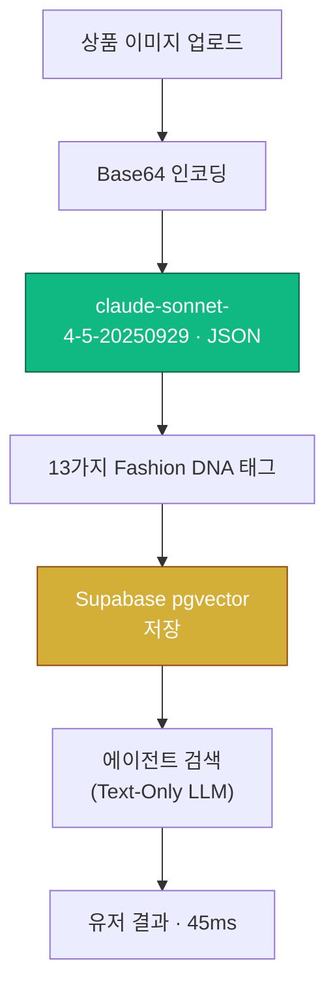

패션 상품 이미지가 있습니다. 유저가 묻습니다: *"비슷하지만 더 포멀한 걸 찾아줘."* 단순한 방법? 매 검색마다 이미지를 Vision-Language Model에 전송합니다.

> **실시간 VLM 추론의 잔인한 경제학:**
> 축하합니다 — 쿼리 하나에 &#36;0.03과 6초의 레이턴시를 태웠습니다. 이걸 일일 10,000건 검색으로 확장하면 추론 비용만으로 하루 &#36;300이 증발합니다.

---

## 🔥 문제: 실시간 VLM 추론은 스케일하지 않는다

대부분의 AI 제품 데모가 편리하게 무시하는 불편한 진실이 있습니다: **Vision-Language Model은 대규모에서 경이적으로 비쌉니다.**

Pickle AI가 "유사 아이템 찾기" 기능을 처음 프로토타이핑했을 때, 아키텍처는 단순했습니다: 유저 쿼리를 가져오고, 상품 이미지를 첨부하고, 둘 다 `claude-sonnet-4-5-20250929`에 보내고, 응답을 반환합니다.

데모에서는 아름답게 작동했습니다. 프로덕션에서는 재앙적으로 비경제적이었습니다.

| 지표 | 실시간 VLM | 구조적 메타데이터 쿼리 |
|---|---|---|
| **검색당 비용** | \$0.030 | \$0.0001 |
| **10k 검색당 비용** | \$300.00 | \$1.00 |
| **레이턴시** | 3.5–6.0s | 45ms |
| **결정론성** | 비결정적 | 결정적 |
| **캐싱 가능성** | ❌ 불가 | ✅ 완전 지원 |
| **스케일링 특성** | 유저당 O(n) | 아이템당 O(1) |

> 매 쿼리마다 실시간 VLM을 돌리는 것은 고객이 지나갈 때마다 엘리트 미술 평론가를 매장 통로에 세워놓고 셔츠를 분석하게 하는 것과 같습니다. **Vision-at-the-Gate**는 평론가가 창고에서 한 번 상세한 스펙 시트를 작성하고, 빠른 데이터베이스가 고객을 응대하게 하는 것입니다.

---

## 🧪 직접 체험: Vision-at-the-Gate 시뮬레이터

아키텍처를 파고들기 전에, 차이를 직접 경험해 보세요:

<simulation-slot demo-id="vlm-scanner-sim"></simulation-slot>

> [!TIP]
> "Simulate Metadata Extraction"을 먼저 클릭하여 13가지 구조적 Fashion DNA 태그가 단일 패스로 추출되는 과정을 확인하세요. 그런 다음 "Reset"을 누르고 "Simulate Real-time VLM"을 시도하여 6초 레이턴시 페널티를 체감해 보세요.

---

## 🏗 아키텍처: Vision-at-the-Gate

핵심 인사이트는 기만적으로 단순합니다: **이해 단계와 추론 단계를 분리하라.**



VLM은 **문지기(Gatekeeper)**이지, 매번 호출되는 서비스가 아닙니다. 인입 시점에서 한 번 실행됩니다. 그 이후의 모든 다운스트림 작업 — 검색, 추천, 개인화 — 은 텍스트 전용 LLM 비용으로 구조적 메타데이터를 활용합니다.

---

## 🧬 딥 태깅: 패션 DNA 분해

`claude-sonnet-4-5-20250929` 모델은 단일 이미지 스캔으로 13가지 구조적 속성을 추출합니다:

```python
import anthropic
import base64

client = anthropic.Anthropic()

def extract_fashion_dna(image_path: str) -> dict:
    """인입 시 단 1회 실행되는 VLM 추출 함수."""
    image_data = base64.standard_b64encode(
        open(image_path, "rb").read()
    ).decode("utf-8")

    response = client.messages.create(
        model="claude-sonnet-4-5-20250929",
        max_tokens=1024,
        messages=[{
            "role": "user",
            "content": [
                {"type": "image", "source": {
                    "type": "base64",
                    "media_type": "image/jpeg",
                    "data": image_data,
                }},
                {"type": "text", "text": """이 패션 아이템을 분석하세요. 유효한 JSON만 반환:
{
  "primary_color": "<dominant color>",
  "secondary_color": "<accent color or null>",
  "material": "<primary fabric>",
  "material_weight": "<light|medium|heavy>",
  "silhouette": "<fitted|relaxed|boxy|oversized>",
  "fit_type": "<slim|regular|relaxed|oversized>",
  "pattern": "<solid|striped|plaid|floral|graphic>",
  "formal_index": <float 0.0-5.0>,
  "warmth_index": <float 0.0-5.0>,
  "season": ["<applicable seasons>"],
  "occasion": ["<suitable occasions>"],
  "layer_compatibility": <float 0.0-1.0>,
  "style_tags": ["<style descriptors>"]
}"""},
            ],
        }],
    )
    return json.loads(response.content[0].text)
```

이 단일 함수 호출의 비용은 이미지당 약 **\$0.003** — 그리고 단 한 번만 실행됩니다.

### 패션 DNA의 4대 축

| 축 | 속성 | 목적 |
|---|---|---|
| **색상 & 소재** | `primary_color`, `secondary_color`, `material`, `material_weight` | 물리적 속성 기반 필터링 |
| **스타일 태그** | `silhouette`, `fit_type`, `pattern`, `style_tags` | 미학적 분류 및 매칭 |
| **TPO / Formal Index** | `formal_index`, `occasion` | 맥락 인식 검색을 위한 TPO 스코어링 |
| **보온성 / 계절성** | `warmth_index`, `season`, `layer_compatibility` | 기후 인식 추천 |

---

## 🗄 데이터 아키텍처: pgvector 중심 설계

| Vector Type | Dim | 용도 | 상태 |
|---|---|---|---|
| `style_dna_vector` | 32 | 개인화 취향 모델링 — 유저 스타일 DNA 매칭 | ✅ Active |
| `description_embedding` | 1536 | OOTD 하이브리드 검색 — 텍스트+벡터 복합 쿼리 | ✅ Active |
| `image_embedding` | 512 | 시각적 유사도 검색 — CLIP 기반 이미지 매칭 | 🗓 Roadmap |

### 하이브리드 검색 쿼리

```sql
SELECT p.id, p.title, p.fashion_dna,
  1 - (p.style_dna_vector <=> $1) AS style_similarity,
  1 - (p.description_embedding <=> $2) AS text_similarity
FROM products p
WHERE p.fashion_dna->>'material' = 'denim'
  AND (p.fashion_dna->>'formal_index')::float BETWEEN 1.5 AND 3.5
ORDER BY
  0.6 * (1 - (p.style_dna_vector <=> $1)) +
  0.4 * (1 - (p.description_embedding <=> $2)) DESC
LIMIT 20;
```

구조적 `WHERE` 절이 하드 필터(소재, 시즌)를 처리하고, `ORDER BY`가 벡터 유사도 점수를 블렌딩합니다. VLM 호출 제로. Sub-50ms 응답.

---

## 📊 경제성: 90% 비용 절감

50,000개 상품, 일일 10,000건 검색 기준 프로덕션 배포 비용 분석:

| 전략 | 10k 검색당 비용 | 월간 (30만건) | 연간 |
|---|---|---|---|
| 실시간 VLM | \$300/일 | \$9,000 | **\$108,000** |
| Vision-at-the-Gate | \$1/일 | \$30 | **\$360** |
| **절감액** | | | **\$107,640 (99.7%)** |

\$155의 일회성 인입 비용은 프로덕션 트래픽 **12시간** 만에 회수됩니다.

> "AI 아키텍처에서 비전(Vision)은 이해를 위한 것이지만, 메타데이터(Metadata)는 확장을 위한 것이다."

---

## 🗺 로드맵: Text-DNA에서 예측적 큐레이션까지

**Phase 1 — Text-DNA Search (현재):** VLM 추출 메타데이터 기반 구조적 필터링 + 텍스트 기반 에이전트 추론.

**Phase 2 — Hybrid Search (다음):** pgvector 코사인 유사도 + BM25 텍스트 스코어 결합.

**Phase 3 — Visual Similarity:** CLIP 기반 `image_embedding`으로 이미지 입력만으로 유사 아이템 검색.

**Phase 4 — Predictive Curation:** 유저 행동 패턴 기반 능동적 스타일 큐레이션.

---

## 🧠 결론: 첫 날부터 스케일을 위해 설계하라

VLM을 런타임 서비스로 취급하고 싶은 유혹이 있습니다. 하지만 소비자 규모에서 이 멘탈 모델은 파산을 초래합니다.

1. **입구에서 한 번 스캔** — 가장 강력한 VLM으로.
2. **DNA를 영속화** — 구조적 메타데이터 + 벡터를 pgvector에.
3. **저렴하게 추론** — 검색 시 텍스트 전용 LLM으로.
4. **자유롭게 스케일** — 유저 증가가 VLM 비용을 늘리지 않음.

> 진정한 비용 최적화는 더 싼 모델을 찾는 것이 아닙니다 — **비싼 모델을 더 적게 호출하는 것**입니다.

<agency-cta />
