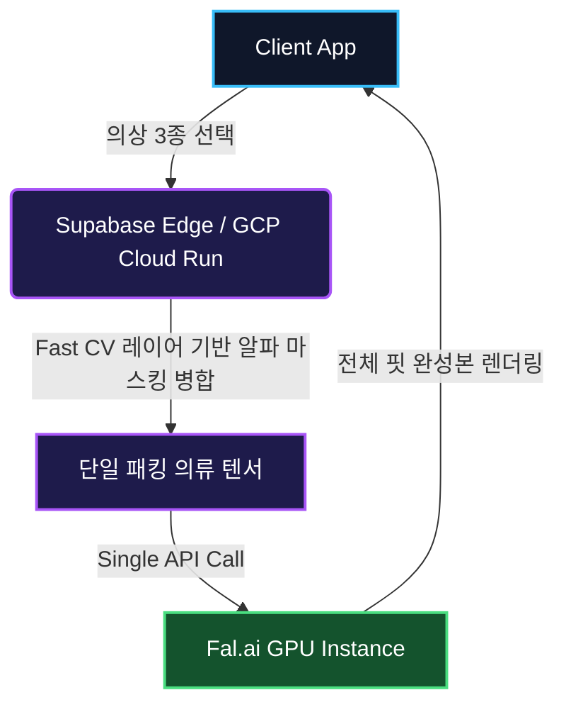

컴퓨터 비전을 활용한 가상 피팅(VTON, Virtual Try-On) 모델은 운영 비용이 극도로 높고 속도가 느립니다. 수백만 명의 활성 사용자(DAU)를 처리해야 하는 패션 이커머스에서 상의, 하의, 아우터를 순차적 생성 AI 추론을 통해 입히는 기본 방식은 이른바 **"60초 이탈(The 60-Second Bounce)"**이라는 최악의 UX를 야기합니다.

사용자들은 실시간 반응을 기대합니다. 로딩 창이 60초 넘게 맴돌면 장바구니 결제율은 급감합니다. 이번 문서에서는 API 호출 수를 의류 개수 $O(N)$에서 **$O(1)$**로 줄여 GPU 인프라 비용을 절반 이하로 억제한 SmartWorkLab의 파이프라인 개편 과정을 분석합니다.

<simulation-slot demo-id="style-dna"></simulation-slot>

---

## 🏗 첫번째 축: "로봇 종이인형" 모델

VTON 아키텍처를 종이인형에 옷을 입히는 과정으로 비유해 보겠습니다. 기존 시스템에서는 셔츠를 가져온 뒤 AI가 사람 위에 그림을 "그리도록" 기다리고, 바지를 가져와 다시 그리는 연산을 반복합니다.

**레거시 파이프라인 ($O(N)$ Inference):**
1. 사용자가 상의 + 하의 + 자켓을 선택합니다.
2. GPU 연산 (상의) $\rightarrow$ 중간 이미지 반환 (20초 소요).
3. GPU 연산 (중간 이미지 위에 하의 생성) $\rightarrow$ 두번째 반환 (20초 소요).
4. GPU 연산 (자켓 생성) $\rightarrow$ 최종 렌더링 (20초 소요).

총 대기 시간: **약 60초.**
총 인프라 비용: **고비용 GPU 추론 API 3회 호출.**

---

## ⚙️ 두번째 축: 효율적인 단일 방향 텐서 흐름

강력한 생성형 AI (Fal.ai 또는 Replicate)가 이 모든 순차 과정을 전담하게 놔두는 대신, 우리는 **Fast CV (고속 컴퓨터 비전)** 작업 부하를 초저가, 초고속 CPU 컨테이너로 이동시켰습니다.

이 연산의 핵심에는 Google이 개발한 크로스 플랫폼 ML 프레임워크인 **MediaPipe**가 있습니다. 우리는 이를 활용하여 33개의 정밀한 골격 랜드마크(Skeletal Keypoints)를 실시간으로 추출합니다. MediaPipe는 CPU 실행에 극도로 최적화되어 있으므로, 우리는 GPU에 의존하지 않고도 공간 워프 매트릭스($H$)를 계산할 수 있습니다.

우리는 호모그래피 워프(Homography Warp) 추적 변환과 같은 클래식 컴퓨터 비전 알고리즘을 사용하여 왜곡된 공간 평면을 **알파 캔버스 배열**로 직접 계산합니다. 원본 공간을 출력 의류 구조에 매핑하는 수학적 공식은 다음과 같이 아름답게 해결됩니다.
$$ p' = H \cdot p $$

우리는 상의, 하의, 아우터를 알파 마스크가 유지된 상태로 *단일* 입력 텐서로 패킹(Packing)합니다. 그리고 이 밀집된 단일 매트릭스를 생성형 AI 모델에 전송합니다. 이러한 아키텍처 분리가 바로 우리의 렌더링 지연 속도를 70%나 극적으로 단축시킨 핵심 비결입니다.

<simulation-slot demo-id="vton-console"></simulation-slot>

---

## 🧠 세번째 축: 인프라 물리 및 메모리 장벽 (엣지 물리 매트릭스)

알파 마스크 렌더링을 완전히 GPU에 위임하면 심각한 VRAM 병목 현상이 발생합니다. 이를 우회하기 위해 우리는 **'엣지 물리 매트릭스'**를 구현했습니다. 전문 컨테이너 내에서 OpenCV를 실행하여 의류의 구조적 경계를 비동기적으로 연산합니다.

**메모리 장벽 (The Memory Wall)**: 무거운 컴퓨터 비전(CV) 처리를 위한 인프라 선택은 명확합니다. OpenCV와 MediaPipe는 네이티브 C++ 바인딩과 대규모 메모리(> 2GB)를 필요로 합니다. 공유 CPU에 의존하며 스로틀링(throttling)이 발생하는 표준 Supabase Edge Functions는 구조적으로 이 요구사항을 감당할 수 없어 "실패(fail)"합니다.

**결정론적 성능 (Deterministic Performance)**: 우리는 CV 마이크로서비스를 오직 **GCP Cloud Run**에만 배포했습니다. Cloud Run은 전용 vCPU를 제공하여, 막대한 트래픽 스파이크에도 수학 공식($p' = H \cdot p$)이 항상 예측 가능한 0.2초 내에 해결되도록 결정론적인 성능을 보장합니다.

**비용 분리 (Cost Segregation)**: 이를 통해 완벽한 비용 최적화가 가능해집니다. 비싼 A100 GPU API(\$0.05/호출)는 오직 조명, 그림자, 블렌딩과 같은 '미학(Aesthetics)' 처리에만 집중시키고, 기반이 되는 모든 '물리(Physics)' 연산은 확장성이 뛰어나고 극도로 저렴한 CPU 컨테이너(\$0.0001/호출)로 분리합니다.

## 👗 네번째 축: 정밀 좌표 동기화 (Canonical Coordination) 및 턱인(Tuck-in) 로직

다중 의류 가상 피팅은 종종 허리선에서 어색함이 발생합니다. 우리의 아키텍처는 **결정론적 레이어 순서(Deterministic Layering Order)**를 따릅니다. 즉, 하의가 먼저 렌더링되고 그 위에 상의가 덧입혀집니다.

만약 `tuck_in=True`(상의 넣어 입기) 모드가 활성화되면, 컴퓨터 비전 엔진이 합성하기 *전에* 상의의 하단 텍스처를 동적으로 확장하여 허리 밴드 영역을 먼저 덮습니다. 이러한 "정밀 좌표 동기화"는 $O(N)$ 순차 처리에서 필연적으로 발생하는 시각적 공백이나 아티팩트(Artifact)를 원천적으로 방지합니다.

---

## 📊 다섯번째 축: 엔터프라이즈 벤치마크 지표

재방문 고객의 렌더링 대기 시간을 제로에 가깝게 맞추기 위해 랜드마크 캐싱을 도입했습니다. 사용자가 기초 프로필을 업로드할 때 생성된 관절 좌표를 **Redis** 서버에 저장하여, 불필요한 OpenPose 연산량을 0에 수렴하도록 설계합니다.

### SmartWorkLab 벤치마크 지표

| 백엔드 구조 | 추론 사이클 | Latency 99p | A100 GPU 비용 | 사용자 경험(UX) |
| :--- | :--- | :--- | :--- | :--- |
| **기존 순차 처리** | 3회 개별 호출 | {`> 60.0s`} | 3배 부하 (\$0.150) | 📉 3/10 (높은 이탈) |
| **SmartWorkLab O(1)** | 1x 통합 마스크 렌더링 | {`< 22.0s`} | 1배 기본 (\$0.050) | 📈 9/10 (몰입형) |

> [!TIP]
> **ROI 분석:** Alpha-Warp 전처리식($H$)을 초저가 GCP 컨테이너 스레드로 옮김으로써 무거운 A100 GPU 비용의 66%를 제거합니다. 1억 명 수준의 DAU 트래픽을 지연 없이 감당하는 동시에 시스템 마진을 극대화하세요.

<AgencyCTA />
